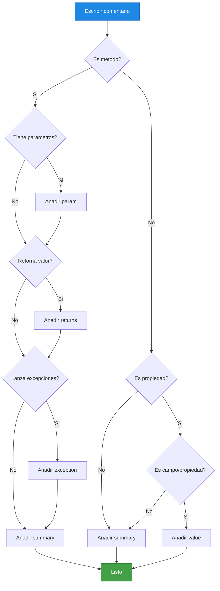

# 1. Documentación de Código

- [1. Documentación de Código](#1-documentación-de-código)
  - [1.1. ¿Por qué Documentar el Código?](#11-por-qué-documentar-el-código)
    - [El Valor de la Documentación](#el-valor-de-la-documentación)
    - [La Regla de Oro: Documenta DURANTE el Desarrollo](#la-regla-de-oro-documenta-durante-el-desarrollo)
  - [1.2. XML Documentation en C# (XMLDoc)](#12-xml-documentation-en-c-xmldoc)
    - [Sintaxis Básica](#sintaxis-básica)
    - [Tags XMLDoc Principales](#tags-xmldoc-principales)
    - [Flujo de Documentación XMLDoc](#flujo-de-documentación-xmldoc)
  - [1.3. Documentación de una Interfaz](#13-documentación-de-una-interfaz)
    - [Ejemplo: IPersonasService](#ejemplo-ipersonasservice)
    - [¿Qué hace falta documentar en una interfaz?](#qué-hace-falta-documentar-en-una-interfaz)
  - [1.4. Documentación de una Clase](#14-documentación-de-una-clase)
    - [Ejemplo: PersonasService](#ejemplo-personasservice)
    - [¿Qué hace falta documentar en una clase?](#qué-hace-falta-documentar-en-una-clase)
  - [1.5. Documentación de Excepciones](#15-documentación-de-excepciones)
    - [Ejemplo: PersonasException](#ejemplo-personasexception)
    - [¿Por qué documentar excepciones?](#por-qué-documentar-excepciones)
  - [1.6. Tags XMLDoc Más Utilizados](#16-tags-xmldoc-más-utilizados)
    - [`<summary>` - Resumen](#summary---resumen)
    - [`<remarks>` - Detalles Adicionales](#remarks---detalles-adicionales)
    - [`<param>` - Parámetros](#param---parámetros)
    - [`<returns>` - Valor de Retorno](#returns---valor-de-retorno)
    - [`<exception>` - Excepciones](#exception---excepciones)
    - [`<example>` - Ejemplo de Uso](#example---ejemplo-de-uso)
    - [`<see>` y `<seealso>` - Referencias Cruzadas](#see-y-seealso---referencias-cruzadas)
    - [`<value>` - Descripción de Propiedades](#value---descripción-de-propiedades)
    - [`<inheritdoc>` - Heredar Documentación](#inheritdoc---heredar-documentación)
  - [1.7. Buenas Prácticas de Documentación](#17-buenas-prácticas-de-documentación)
    - [✅ Haz](#-haz)
    - [❌ No Hacer](#-no-hacer)
  - [1.8. Generación de Documentación](#18-generación-de-documentación)
    - [Habilitar generación de XML](#habilitar-generación-de-xml)
    - [Herramientas de Generación](#herramientas-de-generación)
  - [1.9. Resumen](#19-resumen)


---

## 1.1. ¿Por qué Documentar el Código?

La documentación de código es uno de los pilares fundamentales del desarrollo de software profesional. Un código bien documentado no solo facilita el mantenimiento y la colaboración entre equipos, sino que también reduce significativamente los costes a largo plazo.

> **📝 Nota del Profesor:** Muchos estudiantes piensan que documentar es "perder tiempo" o que "el código se explica solo". Esta es una de las mayores ошибки que puedes cometer en tu carrera profesional.

### El Valor de la Documentación

La documentación de código aporta beneficios tangibles:

- **Mantenibilidad:** Permite entender el código semanas, meses o años después
- **Colaboración:** Facilita el trabajo en equipo
- **Onboarding:** Nuevos desarrolladores pueden entender el sistema más rápido
- **Reducción de errores:** El código documentado tiene menos bugs
- **Conocimiento institucional:** Evita que el conocimiento se pierda cuando alguien deja el proyecto

> **⚠️ Error Común:** Documentar DESPUÉS de escribir el código. La documentación debe ser parte del proceso de desarrollo, no una tarea posterior.

### La Regla de Oro: Documenta DURANTE el Desarrollo

```csharp
// ❌ MALO: Documentar después (nunca lo haces)
// TODO: Documentar esto después

// ✅ BUENO: Documentar mientras escribes
/// <summary>
/// Calcula el precio total incluyendo impuestos.
/// </summary>
/// <param name="precioBase">Precio sin impuestos.</param>
/// <param name="porcentajeImpuesto">Porcentaje de IVA (ej: 21 para 21%).</param>
/// <returns>Precio final con impuestos aplicados.</returns>
public decimal CalcularPrecioConImpuesto(decimal precioBase, int porcentajeImpuesto)
{
    return precioBase * (1 + porcentajeImpuesto / 100m);
}
```

> **💡 Analogía del Día a Día:** Documentar el código después es como escribir el manual de instrucciones después de que el producto ya se haya vendido y usado. Nadie lo hace porque ya es tarde.

---

## 1.2. XML Documentation en C# (XMLDoc)

C# incorpora un sistema de documentación nativo llamado **XML Documentation Comments**. Estas comentarios especiales (`///`) son procesados por el compilador y herramientas como Visual Studio para generar:

- **IntelliSense:** Información contextual mientras escribes código
- **Documentación HTML:** Manuales de API generados automáticamente
- **Validación:** El compilador verifica que los parámetros existan

### Sintaxis Básica

```csharp
/// <summary>
/// Descripción breve del elemento.
/// </summary>
public class MiClase { }
```

### Tags XMLDoc Principales

| Tag            | Uso                      | Ejemplo                      |
| -------------- | ------------------------ | ---------------------------- |
| `<summary>`    | Descripción breve        | Resumen de propósito         |
| `<remarks>`    | Información adicional    | Detalles expandidos          |
| `<param>`      | Parámetro de método      | Descripción del parámetro    |
| `<returns>`    | Valor de retorno         | Qué devuelve el método       |
| `<exception>`  | Excepciones posibles     | Qué excepciones puede lanzar |
| `<example>`    | Ejemplo de uso           | Código de ejemplo            |
| `<see>`        | Referencia cruzada       | Enlace a otro elemento       |
| `<value>`      | Descripción de propiedad | Valor de una propiedad       |
| `<inheritdoc>` | Heredar documentación    | De interfaces/base           |

### Flujo de Documentación XMLDoc



> **💡 Tip:** Este diagrama muestra el proceso mental para decidir que tags usar segun el elemento que documentas.

---

## 1.3. Documentación de una Interfaz

Las interfaces son contratos fundamentales. Su documentación debe ser clara y exhaustiva.

### Ejemplo: IPersonasService

```csharp
using GestionAcademica.Cache;
using GestionAcademica.Enums;
using GestionAcademica.Exceptions;
using GestionAcademica.Models;

namespace GestionAcademica.Services;

/// <summary>
///     Contrato para el servicio de gestión integral de personas (Estudiantes y Docentes).
///     Define la lógica de negocio, validaciones y orquestación de informes.
///     Todos los métodos de consulta devuelven IEnumerable para máximo desacoplamiento.
/// </summary>
public interface IPersonasService {
    /// <summary>
    ///     Obtiene la cantidad total de personas activas en el sistema.
    /// </summary>
    int TotalPersonas { get; }

    /// <summary>
    ///     Devuelve el listado completo de personas activas.
    /// </summary>
    /// <returns>Enumerable con todas las personas activas.</returns>
    IEnumerable<Persona> GetAll();

    /// <summary>
    ///     Devuelve el listado completo aplicando ordenamiento y filtros opcionales.
    /// </summary>
    /// <param name="orden">Criterio de ordenamiento para el listado.</param>
    /// <param name="filtro">Predicado opcional para filtrar los resultados.</param>
    /// <returns>Enumerable con las personas que cumplen los criterios.</returns>
    IEnumerable<Persona> GetAllOrderBy(TipoOrdenamiento orden = TipoOrdenamiento.Dni, Predicate<Persona>? filtro = null);

    /// <summary>
    ///     Localiza una persona activa por su identificador único.
    /// </summary>
    /// <param name="id">Identificador numérico de la persona.</param>
    /// <returns>La instancia de <see cref="Persona" /> encontrada.</returns>
    /// <exception cref="PersonasException.NotFound">Se lanza si el identificador no existe.</exception>
    Persona GetById(int id);

    /// <summary>
    ///     Localiza una persona activa mediante su Documento Nacional de Identidad.
    /// </summary>
    /// <param name="dni">DNI de la persona a buscar.</param>
    /// <returns>La instancia de <see cref="Persona" /> asociada al DNI.</returns>
    /// <exception cref="PersonasException.NotFound">Se lanza si el DNI no corresponde a ninguna persona activa.</exception>
    Persona GetByDni(string dni);

    /// <summary>
    ///     Realiza el registro de una nueva persona (Estudiante o Docente) tras aplicar validaciones.
    /// </summary>
    /// <param name="persona">Instancia de la persona a persistir.</param>
    /// <returns>La persona registrada con su ID y fechas de auditoría asignadas.</returns>
    /// <exception cref="PersonasException.Validation">Se lanza si la validación de campos falla.</exception>
    /// <exception cref="PersonasException.AlreadyExists">Se lanza si el DNI ya está en uso.</exception>
    Persona Save(Persona persona);

    /// <summary>
    ///     Sincroniza y actualiza los datos de una persona existente en el sistema.
    /// </summary>
    /// <param name="id">ID de la persona a actualizar.</param>
    /// <param name="persona">Instancia de la persona con los datos actualizados.</param>
    /// <returns>La persona actualizada con la nueva fecha de modificación.</returns>
    /// <exception cref="PersonasException.NotFound">Se lanza si no se encuentra el registro original.</exception>
    /// <exception cref="PersonasException.Validation">Se lanza si los nuevos datos no son válidos.</exception>
    Persona Update(int id, Persona persona);

    /// <summary>
    ///     Ejecuta el borrado físico de una persona identificada por su ID.
    /// </summary>
    /// <param name="id">ID de la persona a eliminar.</param>
    /// <returns>La instancia de la persona que ha sido marcada como eliminada.</returns>
    /// <exception cref="PersonasException.NotFound">Se lanza si el ID especificado no existe.</exception>
    Persona Delete(int id);
}
```

### ¿Qué hace falta documentar en una interfaz?

- **Propósito:** Qué hace esta interfaz
- **Contrato:** Qué garantiza cada método
- **Parámetros:** Qué significan y qué valores acepta
- **Retornos:** Qué devuelve el método
- **Excepciones:** Cuándo y por qué se lanzan excepciones
- **Referencias:** A qué otras clases/interfaces se refiere

---

## 1.4. Documentación de una Clase

Las clases implementan la lógica. La documentación debe explicar el "cómo" y el "por qué".

### Ejemplo: PersonasService

```csharp
using GestionAcademica.Cache;
using GestionAcademica.Enums;
using GestionAcademica.Exceptions;
using GestionAcademica.Models;
using GestionAcademica.Repositories;
using GestionAcademica.Validators.Common;
using Serilog;

namespace GestionAcademica.Services;

/// <summary>
///     Servicio integral para la gestión de personas (Estudiantes y Docentes).
///     Implementa lógica de negocio mediante pipelines funcionales con LINQ estándar.
/// </summary>
public class PersonasService(
    IPersonasRepository repository,
    IValidador<Persona> valEstudiante,
    IValidador<Persona> valDocente,
    ICache<int, Persona> cache) : IPersonasService {
    private readonly ILogger _logger = Log.ForContext<PersonasService>();

    /// <inheritdoc cref="IPersonasService.TotalPersonas" />
    public int TotalPersonas => repository.GetAll().Count();

    /// <inheritdoc />
    public IEnumerable<Persona> GetAll() {
        _logger.Information("Obteniendo todas las personas.");
        return repository.GetAll();
    }

    /// <inheritdoc />
    public IEnumerable<Estudiante> GetEstudiantesOrderBy(TipoOrdenamiento ordenamiento = TipoOrdenamiento.Dni) {
        _logger.Information("Obteniendo estudiantes ordenados por {ordenamiento}.", ordenamiento);
        return GetAllOrderBy(ordenamiento, p => p is Estudiante)
            .Cast<Estudiante>();
    }

    /// <summary>
    ///     Selecciona el validador correcto según el tipo concreto de Persona (Estudiante/Docente).
    ///     POLIMORFISMO: El switch expression devuelve el validador adecuado sin if/else.
    /// </summary>
    /// <remarks>
    ///     Ejemplo: Si es Estudiante, usa ValidadorEstudiante. Si es Docente, usa ValidadorDocente.
    ///     Este enfoque permite añadir nuevos tipos de persona sin modificar este código.
    /// </remarks>
    private void ValidarPersonaConLogicaPolimorfica(Persona persona) {
        var errores = persona switch {
            Estudiante => valEstudiante.Validar(persona),
            Docente => valDocente.Validar(persona),
            _ => ["Tipo de entidad no soportada para validación."]
        };

        if (errores.Any()) {
            _logger.Warning("Errores de validación encontrados: {errores}", errores);
            throw new PersonasException.Validation(errores);
        }
    }
}
```

### ¿Qué hace falta documentar en una clase?

- **Propósito:** Qué representa y qué responsabilidad tiene
- **Dependencias:** De qué otros componentes depende (inyección)
- **Notas de implementación:** Decisiones de diseño importantes
- **Herencia:** Si hereda de algo, qué aporta
- **Patrones:** Si usa patrones de diseño, cuáles y cómo

---

## 1.5. Documentación de Excepciones

Las excepciones son parte del contrato de un método. Deben documentarse para que el consumidor sepa qué hacer.

### Ejemplo: PersonasException

```csharp
using GestionAcademica.Exceptions.Common;

namespace GestionAcademica.Exceptions;

/// <summary>
///     Contenedor de excepciones específicas para el dominio de Personas.
/// </summary>
public abstract class PersonasException(string message) : DomainException(message) {
    /// <summary>Se lanza cuando no existe el registro solicitado.</summary>
    public sealed class NotFound(string id)
        : PersonasException($"No se ha encontrado ninguna persona con el identificador: {id}");

    /// <summary>Se lanza cuando fallan las reglas de validación de negocio.</summary>
    public sealed class Validation(IEnumerable<string> errors)
        : PersonasException("Se han detectado errores de validación en la entidad.") {
        public IEnumerable<string> Errores { get; init; } = errors;
    }

    /// <summary>Se lanza ante conflictos de duplicidad (DNI).</summary>
    public sealed class AlreadyExists(string dni)
        : PersonasException($"Conflicto de integridad: El DNI {dni} ya está registrado en el sistema.");
}
```

### ¿Por qué documentar excepciones?

1. **Contrato claro:** El consumidor sabe qué esperar
2. **Manejo correcto:** Permite capturar y tratar errores específicos
3. **Traza de errores:** Facilita el diagnóstico de problemas

---

## 1.6. Tags XMLDoc Más Utilizados

### `<summary>` - Resumen

```csharp
/// <summary>
/// Calcula el área de un rectángulo.
/// </summary>
```

> **💡 Tip:** Maximum 1-2 líneas. Debe ser conciso y descriptivo.

### `<remarks>` - Detalles Adicionales

```csharp
/// <summary>
/// Calcula el área de un rectángulo.
/// </summary>
/// <remarks>
/// Esta fórmula es básica geometría. Se utiliza en múltiples 
/// escenarios de cálculo de espacios físicos.
/// </remarks>
```

### `<param>` - Parámetros

```csharp
/// <param name="ancho">Ancho del rectángulo en metros.</param>
/// <param name="alto">Alto del rectángulo en metros.</param>
```

### `<returns>` - Valor de Retorno

```csharp
/// <returns>El área calculada en metros cuadrados.</returns>
```

### `<exception>` - Excepciones

```csharp
/// <exception cref="ArgumentException">Se lanza si ancho o alto son negativos.</exception>
```

### `<example>` - Ejemplo de Uso

```csharp
/// <example>
/// <code>
/// var calculadora = new Calculadora();
/// var area = calculadora.CalcularAreaRectangulo(5, 3);
/// Console.WriteLine(area); // Output: 15
/// </code>
/// </example>
```

### `<see>` y `<seealso>` - Referencias Cruzadas

```csharp
/// <summary>
/// Método que procesa un <see cref="Pedido"/>.
/// </summary>
/// <seealso cref="Pedido"/>
/// <seealso cref="LineaPedido"/>
```

### `<value>` - Descripción de Propiedades

```csharp
/// <value>El nombre completo del usuario.</value>
public string NombreCompleto { get; set; }
```

### `<inheritdoc>` - Heredar Documentación

```csharp
/// <inheritdoc />
public override void MetodoBase() { }
```

---

## 1.7. Buenas Prácticas de Documentación

### ✅ Haz

1. **Documenta mientras codificas:** Escribe la documentación al mismo tiempo que el código
2. **Sé conciso:** Resúmenes de 1-2 líneas
3. **Usa oraciones completas:** Termina con punto
4. **Documenta el "por qué":** No solo el "qué", sino el motivo de las decisiones
5. **Mantén la documentación:** Actualiza cuando cambies el código
6. **Usa `<inheritdoc>`:** Para no duplicar documentación en implementaciones

### ❌ No Hacer

1. **No documentes lo obvio:** `// Incrementa i en 1` es innecesario
2. **No dejar tags vacíos:** `<param name="x"></param>` no sirve
3. **No documentar después:** Si lo dejas para después, no lo harás nunca
4. **No copies la firma:** "This method takes x and returns y" no añade valor
5. **No uses HTML obsoleto:** `<br>` → usa `<para>` en su lugar

> **⚠️ Error Común:** Pensar que "el código se explica solo". El código dice QUÉ hace, la documentación dice CÓMO usarlo y POR QUÉ se hizo así.

---

## 1.8. Generación de Documentación

### Habilitar generación de XML

En el archivo `.csproj`:

```xml
<PropertyGroup>
  <GenerateDocumentationFile>true</GenerateDocumentationFile>
  <!-- Opcional: generar warnings si falta documentación -->
  <NoWarn>$(NoWarn);CS1591</NoWarn>
</PropertyGroup>
```

### Herramientas de Generación

- **DocFX:** Generador de documentación de Microsoft
- **Sandcastle:** Herramienta clásica de Microsoft
- **Doxygen:** Compatible con múltiples lenguajes

---

## 1.9. Resumen

| Aspecto           | Recomendación                                                 |
| ----------------- | ------------------------------------------------------------- |
| **Cuándo**        | Durante el desarrollo, no después                             |
| **Qué**           | El "por qué" y "cómo usarlo", no el "qué hace"                |
| **Dónde**         | Interfaces, clases públicas, métodos complejos                |
| **Cómo**          | Tags XML (`<summary>`, `<param>`, `<returns>`, `<exception>`) |
| **Mantenimiento** | Actualizar con el código                                      |

> **📝 Nota del Profesor:** La documentación es una inversión, no un coste. Un código bien documentado te ahorrará horas de mantenimiento y facilitará el trabajo en equipo.

> **💡 Tip del Examinador:** En un examen de "Clean Code", si te preguntan sobre documentación, enfatiza que debe escribirse DURANTE el desarrollo y mantenerse actualizada. La documentación obsoleta es peor que no tener documentación.
