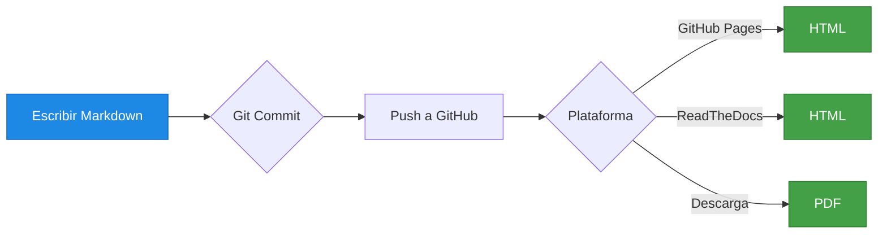

# 2. Markdown para Documentación

- [2. Markdown para Documentación](#2-markdown-para-documentación)
  - [2.1. ¿Qué es Markdown?](#21-qué-es-markdown)
    - [¿Por qué Markdown para Documentación Técnica?](#por-qué-markdown-para-documentación-técnica)
  - [2.2. Sintaxis Básica](#22-sintaxis-básica)
    - [Encabezados](#encabezados)
    - [Párrafos y Saltos de Línea](#párrafos-y-saltos-de-línea)
    - [Formato de Texto](#formato-de-texto)
    - [Listas](#listas)
  - [2.3. Elementos Avanzados](#23-elementos-avanzados)
    - [Código](#código)
    - [Enlaces](#enlaces)
    - [Imágenes](#imágenes)
  - [2.4. Tablas](#24-tablas)
  - [2.5. Elementos Especiales](#25-elementos-especiales)
    - [Líneas Horizontales](#líneas-horizontales)
    - [Notas y Avisos](#notas-y-avisos)
    - [Referencias al Pie](#referencias-al-pie)
    - [Fórmulas Matemáticas](#fórmulas-matemáticas)
  - [2.6. Alertas y Notas en Markdown](#26-alertas-y-notas-en-markdown)
  - [2.7. Ejemplo Completo de Documentación Técnica](#27-ejemplo-completo-de-documentación-técnica)
  - [Endpoints](#endpoints)
    - [GET /usuarios](#get-usuarios)
    - [POST /usuarios](#post-usuarios)
    - [Errores](#errores)
  - [Ejemplo de Uso](#ejemplo-de-uso)
  - [2.8. Herramientas para Documentación Markdown](#28-herramientas-para-documentación-markdown)
    - [Editores](#editores)
    - [Generadores de Documentación](#generadores-de-documentación)
    - [Plataformas que Usan Markdown](#plataformas-que-usan-markdown)
  - [2.9. Mejores Prácticas](#29-mejores-prácticas)
    - [✅ Haz](#-haz)
    - [❌ No Hacer](#-no-hacer)
  - [2.10. Renderizado: De Markdown a HTML, PDF y Otros Formatos](#210-renderizado-de-markdown-a-html-pdf-y-otros-formatos)
    - [Por que es Importante el Renderizado?](#por-que-es-importante-el-renderizado)
    - [Formatos de Salida](#formatos-de-salida)
    - [Como Generar Diferentes Formatos](#como-generar-diferentes-formatos)
    - [Flujo de Trabajo Tipico](#flujo-de-trabajo-tipico)
  - [2.11. Tips y Hacks de Markdown](#211-tips-y-hacks-de-markdown)
    - [Tips para Escribir Mejor](#tips-para-escribir-mejor)
    - [Hacks Utiles](#hacks-utiles)
    - [Atajos de Teclado (VS Code)](#atajos-de-teclado-vs-code)
  - [2.12. Diferencias Entre Sabores de Markdown](#212-diferencias-entre-sabores-de-markdown)
  - [2.13. Resumen](#213-resumen)


---

## 2.1. ¿Qué es Markdown?

Markdown es un lenguaje de marcado ligero creado en 2004 por John Gruber. Permite escribir texto con formato usando una sintaxis simple y legible, que se convierte posteriormente a HTML u otros formatos. Markdown se ha convertido en el formato estándar para la documentación técnica profesional. Su simplicidad y potencia lo hacen ideal para crear documentación clara, legible y fácilmente mantenible.


> **📝 Nota del Profesor:** Markdown es el formato favorito de la documentación técnica moderna. GitHub, GitLab, ReadTheDocs, y muchas otras plataformas lo usan como formato principal.

### ¿Por qué Markdown para Documentación Técnica?

| Ventaja                  | Descripción                                    |
| ------------------------ | ---------------------------------------------- |
| **Legibilidad**          | El código fuente es fácil de leer sin procesar |
| **Simplicidad**          | Sintaxis mínima, aprendizaje rápido            |
| **Portabilidad**         | Funciona en cualquier editor de texto          |
| **Control de versiones** | Ideal para Git (es texto plano)                |
| **Herramientas**         | Generadores de documentación potentes          |
| **Estándar**             | Ampliamente adoptado en la industria           |

> **💡 Analogía:** Si HTML es "traje formal" y Word es "ropa casual", Markdown es "ropa sport elegante": profesional pero cómoda.

---

## 2.2. Sintaxis Básica

### Encabezados

Los encabezados organizan el contenido jerárquicamente:

```markdown
# Encabezado nivel 1
## Encabezado nivel 2
### Encabezado nivel 3
#### Encabezado nivel 4
##### Encabezado nivel 5
###### Encabezado nivel 6
```

> **💡 Tip:** En documentación técnica, usa 1-3 niveles máximo. Evita crear documentos con demasiados niveles de profundidad.

### Párrafos y Saltos de Línea

```markdown
Este es un párrafo.

Este es otro párrafo (deja una línea en blanco).

Esta es una línea.  
Y esta es otra (usa dos espacios al final).
```

### Formato de Texto

```markdown
**Negrita** o __Negrita__

*Cursiva* o _Cursiva_

***Negrita y Cursiva***

~~Tachado~~

`Código en línea`
```

### Listas

**Listas sin orden:**
```markdown
- Elemento 1
- Elemento 2
  - Subelemento 2.1
  - Subelemento 2.2
- Elemento 3
```

**Listas ordenadas:**
```markdown
1. Primer elemento
2. Segundo elemento
3. Tercer elemento
```

**Listas de tareas (checklists):**
```markdown
- [x] Tarea completada
- [ ] Tarea pendiente
- [x] Otra tarea feita
```

---

## 2.3. Elementos Avanzados

### Código

**Código en línea:**
```markdown
Usa el comando `git status` para ver el estado.
```

**Bloques de código:**
```markdown
```csharp
public class Ejemplo
{
    public void Metodo()
    {
        Console.WriteLine("Hola mundo");
    }
}
```
```

### Citas

```markdown
> Esto es una cita
> que puede tener varias líneas

> Cita anidada
>> Dentro de otra cita
```

### Enlaces

**Enlaces básicos:**
```markdown
[Texto del enlace](https://ejemplo.com)

[Enlace con título](https://ejemplo.com "Título opcional")
```

**Enlaces a secciones del documento:**
```markdown
[Ir a Sintaxis](#s)
```

**intaxis-basicaEnlaces a referencias:**
```markdown
[Markdown Guide][1]

[1]: https://www.markdownguide.org/
```

### Imágenes

```markdown


[](https://enlace.com)
```

---

## 2.4. Tablas

Las tablas son esenciales en documentación técnica:

```markdown
| Columna 1 | Columna 2 | Columna 3 |
| --------- | --------- | --------- |
| Celda 1   | Celda 2   | Celda 3   |
| Celda 4   | Celda 5   | Celda 6   |
```

**Tablas alineadas:**
```markdown
| Izquierda | Centro | Derecha |
| :-------- | :----: | ------: |
| Texto     | Texto  |   Texto |
```

> **💡 Tip:** Las tablas en Markdown pueden ser limitadas. Para tablas complejas, considera usar HTML.

---

## 2.5. Elementos Especiales

### Líneas Horizontales

```markdown
---
*** 
___
```

### Notas y Avisos

Aunque no es sintaxis estándar de Markdown, muchas herramientas lo soportan:

```markdown
> **Nota:** Esto es una nota importante.

> **⚠️ Advertencia:** Esto es una advertencia.

> **💡 Tip:** Esto es un consejo útil.
```

### Referencias al Pie

```markdown
Markdown es muy útil [^1].

[^1]: https://www.markdownguide.org/
```

### Fórmulas Matemáticas

```markdown
$$
\sum_{i=1}^{n} a_i = 0
$$
```

---
## 2.6. Alertas y Notas en Markdown

Aunque Markdown no tiene una sintaxis oficial para alertas o notas, muchas plataformas y herramientas de documentación han adoptado convenciones para incluirlas. Estas alertas son útiles para destacar información importante, advertencias o consejos dentro de la documentación técnica.

**Cita:** Nos permiten resaltar información importante, como advertencias o consejos, dentro de la documentación técnica.
```markdown
> **Cita:** Esto es una nota importante.
```

**Nota:** Esto es una nota importante.

```markdown
> [!NOTE]  
> Esto es una nota importante.
```

**Consejo:** Esto es un consejo útil.
```markdown
> [!TIP]
> Esto es un consejo útil.
```

**Advertencia:* Esto es una advertencia crítica.
```markdown
> [!IMPORTANT]  
> Esto es una advertencia crítica.
```

**Peligro:** Esto es un peligro potencial.

```markdown
> [!WARNING]  
> Esto es un peligro potencial.
```

**Precaución:** Esto es una precaución importante.
```markdown
> [!CAUTION]
> Esto es una precaución importante.
```

---

## 2.7. Ejemplo Completo de Documentación Técnica

```markdown
# API de Usuarios

## Descripción
Breve descripción de la API...

## Autenticación

Todos los endpoints requieren token JWT:

```http
Authorization: Bearer <token>
```

## Endpoints

### GET /usuarios

Retorna lista de usuarios.

| Parámetro | Tipo | Descripción          |
| --------- | ---- | -------------------- |
| page      | int  | Número de página     |
| limit     | int  | Elementos por página |

**Respuesta:**
```json
{
  "usuarios": [...],
  "total": 100
}
```

### POST /usuarios

Crea un nuevo usuario.

> **Nota:** Requiere rol de administrador.

### Errores

| Código | Descripción   |
| ------ | ------------- |
| 401    | No autorizado |
| 404    | No encontrado |
| 500    | Error interno |

## Ejemplo de Uso

```csharp
var cliente = new HttpClient();
var response = await cliente.GetAsync("/api/usuarios");
```


---

## 2.8. Herramientas para Documentación Markdown

### Editores

- **Visual Studio Code** - Con extensión Markdown All in One
- **Typora** - Editor WYSIWYG para Markdown
- **Obsidian** - Para notas y documentación interconectada

### Generadores de Documentación

| Herramienta    | Uso                                 |
| -------------- | ----------------------------------- |
| **Docsify**    | Documentación simple desde Markdown |
| **GitBook**    | Documentación colaborativa          |
| **Docusaurus** | Documentación de proyectos React    |
| **MkDocs**     | Documentación con Python            |
| **Hugo**       | Generador de sitios estáticos       |

### Plataformas que Usan Markdown

- **GitHub / GitLab** - READMEs, wikis
- **ReadTheDocs** - Documentación de bibliotecas
- **Notion** - Notas y documentación
- **Discord** - Mensajes con formato

---

## 2.9. Mejores Prácticas

### ✅ Haz

1. **Usa encabezados jerárquicos** - Organiza el contenido lógicamente
2. **Mantén líneas cortas** - Facilita la revisión en Git
3. **Code blocks con lenguaje** - Añade resaltado de sintaxis
4. **Usa tablas** - Para datos estructurados
5. **Enlaces relativos** - Para documentación en repositorios

### ❌ No Hacer

1. **No abuses de los niveles** - Máximo H3 o H4
2. **No pongas código sin formato** - Usa code blocks
3. **No descuides los enlaces** - Verifica que funcionan
4. **No mezcles formatos** - Sé consistente

> **⚠️ Error Común:** Escribir documentación en Word y luego convertirla. Markdown se escribe directamente en Markdown desde el principio.

---

## 2.10. Renderizado: De Markdown a HTML, PDF y Otros Formatos

Una de las mayores ventajas de Markdown es su capacidad para transformarse en múltiples formatos de salida. El texto fuente permanece igual, pero las herramientas de renderizado lo convierten en el formato que necesites.

### Por que es Importante el Renderizado?

```
+-------------------------------------+
|         MARKDOWN (FUENTE)          |
|         (.md - texto plano)        |
+-------------+-----------------------+
             |
             | Renderizado
             v
+-------------------------------------+
|         FORMATOS DE SALIDA          |
+-------+-------+-------+-------+-------+
| HTML  | PDF   | DOCX  | ePub  | Wiki  |
+-------+-------+-------+-------+-------+
```

> **💡 Analogía:** Markdown es como un negativo de fotografia. El negativo (Markdown) es un formato universal que puedes revelar (renderizar) en cualquier tamaño o formato (HTML, PDF, impresion, etc.).

### Formatos de Salida

| Formato   | Uso                                | Herramientas                  |
| --------- | ---------------------------------- | ----------------------------- |
| **HTML**  | Paginas web, blogs                 | GitHub Pages, MkDocs, Docsify |
| **PDF**   | Documentos para imprimir, manuales | Pandoc, VS Code + PDF         |
| **DOCX**  | Documentos editable (Word)         | Pandoc                        |
| **ePub**  | Libros electronicos                | Pandoc                        |
| **LaTeX** | Publicaciones academicas           | Pandoc                        |
| **Wiki**  | Plataformas como Confluence        | GitHub, GitLab                |

### Como Generar Diferentes Formatos

**HTML (mas comun):**
```bash
# Usando docsify (documentacion web)
npx docsify init ./docs

# Usando MkDocs
pip install mkdocs
mkdocs build
```

**PDF:**
```bash
# Usando Pandoc
pandoc documento.md -o documento.pdf
```

**DOCX (Word):**
```bash
pandoc documento.md -o documento.docx
```

### Flujo de Trabajo Tipico



> **📝 Nota del Profesor:** En el mundo real, escribes en Markdown una vez y la herramienta de renderizado se encarga de generar automaticamente la web, el PDF, etc. Esto es "Documentation as Code".

---

## 2.11. Tips y Hacks de Markdown

### Tips para Escribir Mejor

**1. Tabla de Contenidos Automatica**
```markdown
- [Introduccion](#introduccion)
- [Instalacion](#instalacion)
```

**2. Personalizar Enlaces con Texto**
```markdown
[haz clic aqui][enlace-doc]

[enlace-doc]: https://documentacion.com
```

**3. Codigo con Multiples Lenguajes**
```markdown
```python
def hola():
    print("Hola")
```

```javascript
console.log("Hola");
```
```

**4. Desactivar Formato con barra invertida**
```markdown
\*Este texto no esta en cursiva\*
```

**5. Anclar Enlaces Exactly**
```markdown
[Mi Seccion Miuda](#mi-seccion-minuda)
```

### Hacks Utiles

**Hack 1: Escapar caracteres**
```markdown
\* asterisco \_
\| tuberia \`
```

**Hack 2: Codigo dentro de negrita**
```markdown
Usa el comando **`git commit -m`** para guardar.
```

**Hack 3: Listas con bloque de codigo**
```markdown
- Instalar dependencia:
  ```bash
  npm install package-name
  ```
```

**Hack 4: Anclas en encabezados**
```markdown
## Mi Encabezado {#mi-anchor}
```

**Hack 5: Notas al pie multiples**
```markdown
Informacion [^1] y mas informacion [^2].

[^1]: Primera nota.
[^2]: Segunda nota.
```

### Atajos de Teclado (VS Code)

| Atajo              | Accion                    |
| ------------------ | ------------------------- |
| `Ctrl + Shift + V` | Previsualizar Markdown    |
| `Ctrl + K V`       | Previsualizar lado a lado |
| `Alt + Z`          | Ajuste de linea           |
| `Ctrl + Shift + P` | Buscar comandos           |

> **💡 Tip:** VS Code con la extension "Markdown All in One" ofrece previsualizacion en tiempo real mientras escribes.

---

## 2.12. Diferencias Entre Sabores de Markdown

No todos los Markdown son iguales. Existen diferentes "sabores" (flavors):

| Flavor                             | Caracteristicas                 |
| ---------------------------------- | ------------------------------- |
| **CommonMark**                     | Estandar basico                 |
| **GitHub Flavored Markdown (GFM)** | Tablas, code fences, checklists |
| **Microsoft Docs Markdown**        | Extensiones para Azure DevOps   |
| **Obsidian/Notion**                | Wikis internos                  |

> **⚠️ Aviso:** Lo que funciona en GitHub puede no funcionar en todas partes. Verifica la compatibilidad si necesitas portabilidad maxima.

---

## 2.13. Resumen

Markdown es el estandar de la documentacion tecnica moderna porque:

1. **Versatilidad** - Se renderiza a HTML, PDF, DOCX, ePub...
2. **Productividad** - Escribe una vez, publica en todas partes
3. **Colaboracion** - Git maneja texto plano perfectamente
4. **Herramientas** - Generadores automaticos de sitios web
5. **Profesionalidad** - Toda la industria lo usa

> **📝 Nota del Profesor:** El flujo de trabajo moderno es: escribir documentacion en Markdown -> commit a Git -> renderizado automatico a HTML (GitHub Pages, ReadTheDocs) y PDF. Esto es "Documentation as Code".

> **💡 Tip del Examinador:** En un examen, enfatiza que Markdown no solo es "escribir con #", sino que es un ecosistema completo que incluye renderizado, versionado y publicacion automaticos.
