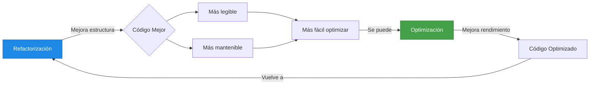
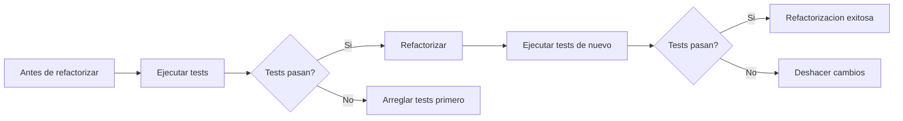

# 3. Refactorización de Código

- [3. Refactorización de Código](#3-refactorización-de-código)
  - [3.1. ¿Qué es la Refactorización?](#31-qué-es-la-refactorización)
    - [Definición Técnica](#definición-técnica)
    - [Diferencia con otras actividades](#diferencia-con-otras-actividades)
  - [3.2. Refactorización y Optimización: Dos Caras de la Misma Moneda](#32-refactorización-y-optimización-dos-caras-de-la-misma-moneda)
    - [¿Cómo se Relacionan?](#cómo-se-relacionan)
    - [Ejemplo: Un Código Bien Refactorizado También Está Optimizado](#ejemplo-un-código-bien-refactorizado-también-está-optimizado)
  - [3.3. ¿Por Qué es Importante la Refactorización?](#33-por-qué-es-importante-la-refactorización)
    - [Beneficios Principales](#beneficios-principales)
    - [Cuándo Refactorizar](#cuándo-refactorizar)
    - [La Regla del Boy Scout](#la-regla-del-boy-scout)
  - [3.4. ¿Cómo Saber Si una Refactorización Está Bien?](#34-cómo-saber-si-una-refactorización-está-bien)
    - [1. ✅ No Cambia el Comportamiento](#1--no-cambia-el-comportamiento)
    - [2. ✅ Pasa los Tests](#2--pasa-los-tests)
    - [3. ✅ Es Incremental](#3--es-incremental)
    - [4. ✅ Mejora la Calidad](#4--mejora-la-calidad)
  - [3.5. Refactorización en JetBrains Rider](#35-refactorización-en-jetbrains-rider)
    - [Cómo Ejecutar una Refactorización](#cómo-ejecutar-una-refactorización)
    - [Atajos de Refactorización en Rider](#atajos-de-refactorización-en-rider)
  - [3.6. Principales Refactorizaciones en Rider](#36-principales-refactorizaciones-en-rider)
    - [Rename (Renombrar) - `Shift+F6`](#rename-renombrar---shiftf6)
    - [Extract Method (Extraer Método) - `Ctrl+Alt+M`](#extract-method-extraer-método---ctrlaltm)
    - [Change Signature (Cambiar Firma) - `Ctrl+F6`](#change-signature-cambiar-firma---ctrlf6)
    - [Introduce Variable (Introducir Variable) - `Ctrl+Alt+V`](#introduce-variable-introducir-variable---ctrlaltv)
    - [Introduce Field (Introducir Campo) - `Ctrl+Alt+F`](#introduce-field-introducir-campo---ctrlaltf)
    - [Introduce Parameter (Introducir Parámetro) - `Ctrl+Alt+P`](#introduce-parameter-introducir-parámetro---ctrlaltp)
    - [Inline (Inline) - `Ctrl+Alt+N`](#inline-inline---ctrlaltn)
    - [Move (Mover) - `F6`](#move-mover---f6)
    - [Safe Delete (Eliminar Seguro) - `Alt+Delete`](#safe-delete-eliminar-seguro---altdelete)
    - [Encapsulate Field (Encapsular Campo) - `Ctrl+Shift+E`](#encapsulate-field-encapsular-campo---ctrlshifte)
    - [Extract Interface (Extraer Interfaz) - `Ctrl+Alt+X`](#extract-interface-extraer-interfaz---ctrlaltx)
    - [Extract Superclass (Extraer Superclase)](#extract-superclass-extraer-superclase)
    - [Extract Class (Extraer Clase)](#extract-class-extraer-clase)
    - [Pull Members Up (Subir Miembros)](#pull-members-up-subir-miembros)
    - [Push Members Down (Bajar Miembros)](#push-members-down-bajar-miembros)
    - [Convert to Auto-Property (Convertir a Auto-Prpiedad)](#convert-to-auto-property-convertir-a-auto-prpiedad)
    - [Convert Property to Method(s) (Convertir Propiedad a Método)](#convert-property-to-methods-convertir-propiedad-a-método)
    - [Invert Boolean (Invertir Booleano) - `Ctrl+Shift+B`](#invert-boolean-invertir-booleano---ctrlshiftb)
    - [Make Method Static (Hacer Método Estático)](#make-method-static-hacer-método-estático)
    - [Make Method Non-Static (Hacer Método No Estático)](#make-method-non-static-hacer-método-no-estático)
    - [Replace Constructor with Factory Method](#replace-constructor-with-factory-method)
    - [Convert Abstract Class to Interface](#convert-abstract-class-to-interface)
    - [Convert Interface to Abstract Class](#convert-interface-to-abstract-class)
    - [Convert Method to Property](#convert-method-to-property)
    - [Convert Property to Indexer](#convert-property-to-indexer)
    - [Convert Indexer to Method](#convert-indexer-to-method)
    - [Convert Anonymous to Named Type](#convert-anonymous-to-named-type)
    - [Convert to Global Using](#convert-to-global-using)
    - [Convert to Non-Global Using](#convert-to-non-global-using)
    - [Copy Type (Copiar Tipo)](#copy-type-copiar-tipo)
    - [Use Base Type Where Possible](#use-base-type-where-possible)
    - [Add/Remove params modifier](#addremove-params-modifier)
    - [Transform Parameters](#transform-parameters)
    - [Extract Members to Partial](#extract-members-to-partial)
    - [Tabla Resumen de Refactorizaciones y Atajos](#tabla-resumen-de-refactorizaciones-y-atajos)
  - [3.7. Refactorizaciones In-Place](#37-refactorizaciones-in-place)
    - [Cómo Funciona](#cómo-funciona)
    - [Ejemplo: Rename In-Place](#ejemplo-rename-in-place)
  - [3.8. Resolución de Conflictos](#38-resolución-de-conflictos)
    - [Tipos de Conflictos](#tipos-de-conflictos)
    - [Cómo Resolver](#cómo-resolver)
  - [3.9. Refactorización y Calidad del Código](#39-refactorización-y-calidad-del-código)
    - [Código Antes de Refactorizar](#código-antes-de-refactorizar)
    - [Código Después de Refactorizar](#código-después-de-refactorizar)
    - [Mejoras Aplicadas](#mejoras-aplicadas)
  - [3.10. Cuándo NO Refactorizar](#310-cuándo-no-refactorizar)
  - [3.11. Resumen](#311-resumen)


---

## 3.1. ¿Qué es la Refactorización?

La refactorización (del inglés "refactoring") es el proceso de restructurar el código existente, cambiar su forma sin alterar su comportamiento. Es como reorganizar los muebles de una casa: la casa sigue siendo la misma, pero está más ordenada y es más cómoda de usar.

La refactorización es una práctica fundamental en el desarrollo de software profesional. Consiste en modificar la estructura interna del código sin cambiar su comportamiento externo, con el objetivo de mejorar su calidad, legibilidad y mantenibilidad.

> **📝 Nota del Profesor:** La refactorización NO es corregir bugs ni añadir nuevas funcionalidades. Es mejorar el código existente para que sea más fácil de entender y modificar en el futuro.

### Definición Técnica

Según Martin Fowler, autor del libro de referencia sobre refactorización:

> "Refactorización: una técnica disciplinada para restructurar código existente, alterando su estructura interna sin cambiar su comportamiento externo."

### Diferencia con otras actividades

| Actividad               | Objetivo                   | ¿Cambia comportamiento?       |
| ----------------------- | -------------------------- | ----------------------------- |
| **Refactorización**     | Mejorar estructura interna | No                            |
| **Corrección de bugs**  | Eliminar errores           | Sí (los bugs desaparecen)     |
| **Nueva funcionalidad** | Añadir características     | Sí (nuevo comportamiento)     |
| **Optimización**        | Mejorar rendimiento        | A veces (si cambia algoritmo) |

> **💡 Analogía:** Imagina que tienes un escritorio desordenado con papeles por todas partes. La refactorización es como ordenar los papeles en carpetas etiquetadas. El contenido de los papeles no cambia, pero ahora puedes encontrar lo que necesitas mucho más rápido.

---

## 3.2. Refactorización y Optimización: Dos Caras de la Misma Moneda

> **📝 Nota del Profesor:** Refactorización y optimización están íntimamente relacionadas. Cuando refactorizamos, frecuentemente también optimizamos, y viceversa. Son dos objetivos que van de la mano.

### ¿Cómo se Relacionan?



### Ejemplo: Un Código Bien Refactorizado También Está Optimizado

**Código original (sin refactorizar):**
```csharp
public List<Estudiante> GetAprobados(List<Estudiante> lista)
{
    var resultado = new List<Estudiante>();
    for (int i = 0; i < lista.Count; i++)
    {
        if (lista[i].Nota >= 5)
        {
            resultado.Add(lista[i]);
        }
    }
    return resultado;
}
```

**Código refactorizado y optimizado:**
```csharp
public List<Estudiante> GetAprobados(List<Estudiante> estudiantes)
{
    return estudiantes
        .Where(e => e.Nota >= 5)
        .ToList();
}
```

**Mejoras conseguidas:**
- ✅ **Refactorización:** Código más legible (declarativo vs imperativo)
- ✅ **Optimización:** Más conciso, menor probabilidad de errores
- ✅ **Calidad:** Código más mantenible y testeable

> **💡 Tip del Examinador:** En la práctica, cuando optimizas código, también lo estás refactorizando. Y cuando refactorizas para mejorar la estructura, frecuentemente también mejoras el rendimiento de forma indirecta.

---

---

## 3.3. ¿Por Qué es Importante la Refactorización?

### Beneficios Principales

1. **Legibilidad:** Código más fácil de entender
2. **Mantenibilidad:** Cambios más fáciles de implementar
3. **Reutilización:** Componentes más modulares
4. **Reducción de deuda técnica:** Evita que el código se degrade
5. **Facilita el Testing:** Código más testeable
6. **Colaboración:** Mejor trabajo en equipo

### Cuándo Refactorizar

**Señales de que necesitas refactorizar:**

- 📌 Código duplicado
- 📌 Métodos demasiado largos
- 📌 Clases con demasiadas responsabilidades
- 📌 Nombres poco claros o confusos
- 📌 Comentarios que explican código mal escrito
- 📌 Dificultad para hacer cambios
- 📌 Tests difíciles de escribir⚠️ Error Común:** "Si funciona, no lo

> ** toques". Este pensamiento crea deuda técnica que será cada vez más costosa de pagar.

### La Regla del Boy Scout

> "Deja el código más limpio de lo que lo encontraste."

Cada vez que modifiques un archivo, intenta mejorarlo un poco. No hace falta refactorizar todo de golpe.

---

## 3.4. ¿Cómo Saber Si una Refactorización Está Bien?

La refactorización está bien cuando cumple estos criterios:

### 1. ✅ No Cambia el Comportamiento

```csharp
// ANTES
public int Sumar(int a, int b)
{
    return a + b;
}

// DESPUÉS (refactorizado)
public int CalcularSuma(int operando1, int operando2)
{
    return operando1 + operando2;
}

// El resultado es el mismo: 2 + 3 = 5
// Pero el nombre es más claro
```

### 2. ✅ Pasa los Tests

> **📝 Nota del Profesor:** Los tests son esenciales. Antes de refactorizar, asegúrate de tener tests que verifiquen el comportamiento. Después de refactorizar, los tests deben seguir pasando.



### 3. ✅ Es Incremental

Los mejores refactorizaciones son pequeñas y frecuentes:

- ✅ Cambios pequeños y seguros
- ✅ Cada paso verificable
- ✅ Compromiso atómico con Git

### 4. ✅ Mejora la Calidad

Código de calidad tiene estas características:

| Métrica            | Descripción                         |
| ------------------ | ----------------------------------- |
| **Cohesión**       | Cada clase hace una cosa bien       |
| **Acoplamiento**   | Dependencias mínimas entre clases   |
| **Nombres claros** | El código se explica solo           |
| **Simplicidad**    | Solución más simple posible         |
| **Testeabilidad**  | Fácil de probar con tests unitarios |

---

## 3.5. Refactorización en JetBrains Rider

Rider proporciona un conjunto completo de refactorizaciones automatizadas que permiten renombrar, mover y eliminar símbolos de forma segura, además de introducir y aplicar inline a campos, variables o parámetros.

### Cómo Ejecutar una Refactorización

1. **Coloca el cursor** en el símbolo o selecciona el código a refactorizar
2. **Invoca la refactorización:**
   - Menú: `Refactor` → seleccionar refactorización
   - Atajo: `Ctrl+Alt+Shift+T` (Refactor This)
   - Clic derecho → `Refactor This`
3. **Completa el asistente** si requiere información adicional
4. **Resuelve conflictos** si los hay
5. **Deshacer con Ctrl+Z** si algo sale mal


### Atajos de Refactorización en Rider

| Atajo        | Refactorización     |
| ------------ | ------------------- |
| `Shift+F6`   | Rename (Renombrar)  |
| `Ctrl+F6`    | Change Signature    |
| `Ctrl+Alt+N` | Inline              |
| `F6`         | Move                |
| `Ctrl+Alt+M` | Extract Method      |
| `Ctrl+Alt+F` | Introduce Field     |
| `Ctrl+Alt+P` | Introduce Parameter |
| `Ctrl+Alt+V` | Introduce Variable  |
| `Alt+Delete` | Safe Delete         |

---

## 3.6. Principales Refactorizaciones en Rider

A continuación se detallan las refactorizaciones más importantes disponibles en Rider, con su atajo de teclado correspondiente:

### Rename (Renombrar) - `Shift+F6`

Permite cambiar el nombre de cualquier símbolo en la solución. Todas las referencias se actualizan automáticamente.

**Puedes renombrar:**
- Proyectos
- Namespaces
- Tipos (clases, interfaces, etc.)
- Métodos
- Campos
- Propiedades
- Parámetros
- Variables locales

**Ejemplo:**
```csharp
// ANTES
public class Us
{
    public void Proc()
    {
        var x = 10;
    }
}

// DESPUÉS
public class UserProcessor
{
    public void Process()
    {
        var count = 10;
    }
}
```


---

### Extract Method (Extraer Método) - `Ctrl+Alt+M`

Crea un nuevo método basado en el código seleccionado. Rider analiza las variables y detecta cuáles pueden convertirse en parámetros.

**Ejemplo:**
```csharp
// ANTES
public void ImprimirInvertido(string input)
{
    var caracteres = input.ToCharArray();
    Array.Reverse(caracteres);
    var invertido = new string(caracteres);
    Console.WriteLine(invertido);
}

// DESPUÉS
public void ImprimirInvertido(string input)
{
    var invertido = InvertirCadena(input);
    Console.WriteLine(invertido);
}

private string InvertirCadena(string input)
{
    var caracteres = input.ToCharArray();
    Array.Reverse(caracteres);
    return new string(caracteres);
}
```


---

### Change Signature (Cambiar Firma) - `Ctrl+F6`

Permite modificar la firma de un método:
- Nombre del método
- Parámetros (añadir, eliminar, reordenar)
- Tipos de parámetros
- Valores por defecto
- Tipo de retorno

---

### Introduce Variable (Introducir Variable) - `Ctrl+Alt+V`

Extrae una expresión a una variable local para mejorar la legibilidad.

```csharp
// ANTES
if (usuario.FechaNacimiento.AddYears(18) > DateTime.Now)

// DESPUÉS
var esMenor = usuario.FechaNacimiento.AddYears(18) > DateTime.Now;
if (esMenor)
```

---

### Introduce Field (Introducir Campo) - `Ctrl+Alt+F`

Similar a Introduce Variable, pero crea un campo de clase en lugar de una variable local.

---

### Introduce Parameter (Introducir Parámetro) - `Ctrl+Alt+P`

Convierte una variable local en un parámetro del método.

---

### Inline (Inline) - `Ctrl+Alt+N`

Lo opuesto a Extract Method. Reemplaza una llamada a método por su contenido, o une una variable con su valor.

**Tipos de Inline:**
- Inline Method
- Inline Variable
- Inline Parameter
- Inline Field
- Inline Class

---

### Move (Mover) - `F6`

Mueve elementos a otra ubicación:
- **Move Type to Another File:** Mueve una clase a su propio archivo
- **Move Type to Another Namespace:** Cambia el namespace
- **Move Type to Another Type:** Mueve una clase anidada
- **Move Instance Method:** Mueve un método a otra clase
- **Move to Folder:** Organiza archivos en carpetas

---

### Safe Delete (Eliminar Seguro) - `Alt+Delete`

Elimina un símbolo solo si no hay referencias a él. Si hay usos, avisa antes de eliminar.

---

### Encapsulate Field (Encapsular Campo) - `Ctrl+Shift+E`

Convierte un campo público en propiedad con getter/setter.

```csharp
// ANTES
public class Producto
{
    public string nombre;
}

// DESPUÉS
public class Producto
{
    public string Nombre { get; set; }
}
```

---

### Extract Interface (Extraer Interfaz) - `Ctrl+Alt+X`

Crea una nueva interfaz con miembros seleccionados de una clase existente.

```csharp
// ANTES
public class GestorUsuarios
{
    public void Crear() { }
    public void Eliminar() { }
    public void Actualizar() { }
}

// DESPUÉS (se crea IUsuarioRepository)
public interface IUsuarioRepository
{
    void Crear();
    void Eliminar();
    void Actualizar();
}

public class GestorUsuarios : IUsuarioRepository
{
    public void Crear() { }
    public void Eliminar() { }
    public void Actualizar() { }
}
```

---

### Extract Superclass (Extraer Superclase)

Crea una clase base con miembros seleccionados de una clase existente.

---

### Extract Class (Extraer Clase)

Extrae miembros seleccionados a una nueva clase, útil cuando una clase tiene demasiadas responsabilidades.

---

### Pull Members Up (Subir Miembros)

Mueve miembros de una clase derivada a su clase base.

---

### Push Members Down (Bajar Miembros)

Mueve miembros de una clase base a sus clases derivadas.

---

### Convert to Auto-Property (Convertir a Auto-Prpiedad)

Convierte una propiedad con backing field a auto-property.

```csharp
// ANTES
private string _nombre;
public string Nombre
{
    get { return _nombre; }
    set { _nombre = value; }
}

// DESPUÉS
public string Nombre { get; set; }
```

---

### Convert Property to Method(s) (Convertir Propiedad a Método)

Lo opuesto: convierte una auto-property a métodos getter/setter explícitos.

---

### Invert Boolean (Invertir Booleano) - `Ctrl+Shift+B`

Invierte el valor de una propiedad o campo booleano.

```csharp
// ANTES
public bool Activo { get; set; }

// DESPUÉS
public bool Inactivo { get; set; }
```

---

### Make Method Static (Hacer Método Estático)

Convierte un método de instancia a método estático.

---

### Make Method Non-Static (Hacer Método No Estático)

Lo opuesto: convierte un método estático a método de instancia.

---

### Replace Constructor with Factory Method

Reemplaza el constructor por un método factory estático.

```csharp
// ANTES
var usuario = new Usuario("Juan");

// DESPUÉS
var usuario = Usuario.Crear("Juan");
```

---

### Convert Abstract Class to Interface

Convierte una clase abstracta sin implementación a interfaz.

---

### Convert Interface to Abstract Class

Lo opuesto: convierte una interfaz a clase abstracta.

---

### Convert Method to Property

Convierte un método simple a propiedad.

```csharp
// ANTES
public int ObtenerEdad()
{
    return DateTime.Now.Year - FechaNacimiento.Year;
}

// DESPUÉS
public int Edad
{
    get { return DateTime.Now.Year - FechaNacimiento.Year; }
}
```

---

### Convert Property to Indexer

Convierte una propiedad a indexador.

---

### Convert Indexer to Method

Lo opuesto: convierte un indexador a método.

---

### Convert Anonymous to Named Type

Convierte un tipo anónimo a clase o estructura con nombre.

---

### Convert to Global Using

Convierte un using local a global.

---

### Convert to Non-Global Using

Lo opuesto: convierte un using global a local.

---

### Copy Type (Copiar Tipo)

Copia una clase a un nuevo archivo.

---

### Use Base Type Where Possible

Reemplaza tipos derivados por su tipo base cuando sea posible.

---

### Add/Remove params modifier

Añade o elimina el modificador `params` de un parámetro.

---

### Transform Parameters

Transforma parámetros (por ejemplo, de parámetros normales a params array o viceversa).

---

### Extract Members to Partial

Extrae miembros seleccionados a una clase partial.

---

### Tabla Resumen de Refactorizaciones y Atajos

| Atajo          | Refactorización     | Descripción          |
| -------------- | ------------------- | -------------------- |
| `Shift+F6`     | Rename              | Renombrar símbolo    |
| `Ctrl+Alt+M`   | Extract Method      | Extraer método       |
| `Ctrl+F6`      | Change Signature    | Cambiar firma        |
| `Ctrl+Alt+N`   | Inline              | Aplicar inline       |
| `F6`           | Move                | Mover elemento       |
| `Ctrl+Alt+V`   | Introduce Variable  | Introducir variable  |
| `Ctrl+Alt+F`   | Introduce Field     | Introducir campo     |
| `Ctrl+Alt+P`   | Introduce Parameter | Introducir parámetro |
| `Alt+Delete`   | Safe Delete         | Eliminar seguro      |
| `Ctrl+Shift+E` | Encapsulate Field   | Encapsular campo     |
| `Ctrl+Alt+X`   | Extract Interface   | Extraer interfaz     |
| `Ctrl+Shift+B` | Invert Boolean      | Invertir booleano    |

---

## 3.7. Refactorizaciones In-Place

Rider permite aplicar algunas refactorizaciones directamente en el editor, sin invocar comandos.

### Cómo Funciona

1. Modifica el código en el editor
2. Rider detecta que es una intención de refactorizar
3. Aparece un borde gris alrededor del código modificado
4. Presiona `Alt+Enter` para aplicar la refactorización

### Ejemplo: Rename In-Place

```
1. Colocas el cursor en el nombre
2. Escribes el nuevo nombre
3. Aparece borde gris
4. Presionas Alt+Enter
5. ¡Refactorización aplicada en toda la solución!
```

---

## 3.8. Resolución de Conflictos

Cuando una refactorización afecta muchos archivos, pueden surgir conflictos. Rider los detecta y muestra soluciones.

### Tipos de Conflictos

| Icono       | Tipo                 | Descripción                              |
| ----------- | -------------------- | ---------------------------------------- |
| ⚠️ (Warning) | Uso que se eliminará | Puede eliminarse sin romper compilación  |
| ❌ (Error)   | Conflicto real       | Romperá la compilación si no se resuelve |

### Cómo Resolver

1. **Navegar al conflicto:** Haz clic en el enlace para ver el código
2. **Resolver manualmente:** Edita el código conflictivo
3. **Forzar:** Puedes continuar incluso con errores (no recomendado)
4. **Cancelar:** Deshacer todos los cambios

---

## 3.9. Refactorización y Calidad del Código

### Código Antes de Refactorizar

```csharp
public class c
{
    public int p(string s)
    {
        var l = s.Split(',');
        var r = 0;
        foreach(var i in l)
        {
            r += int.Parse(i);
        }
        return r;
    }
}
```

### Código Después de Refactorizar

```csharp
public class CalculadoraSumatoria
{
    /// <summary>
    /// Calcula la suma de una lista de números separados por comas.
    /// </summary>
    /// <param name="numeros">Cadena con números separados por comas.</param>
    /// <returns>Suma total de los números.</returns>
    public int SumarNumeros(string numeros)
    {
        var listaNumeros = numeros.Split(',');
        var resultado = 0;
        
        foreach (var numero in listaNumeros)
        {
            resultado += int.Parse(numero);
        }
        
        return resultado;
    }
}
```

### Mejoras Aplicadas

| Aspecto                  | Antes    | Después                     |
| ------------------------ | -------- | --------------------------- |
| **Nombre de clase**      | `c`      | `CalculadoraSumatoria`      |
| **Nombre de método**     | `p`      | `SumarNumeros`              |
| **Nombre de parámetros** | `s`      | `numeros`                   |
| **Variables**            | `l`, `r` | `listaNumeros`, `resultado` |
| **Documentación**        | No       | XMLDoc                      |
| **Formato**              | Compacto | Legible                     |

---

## 3.10. Cuándo NO Refactorizar

Aunque la refactorización es beneficiosa, hay momentos en los que NO debes hacerlo:

1. **Cerca de una entrega:** No refactorices justo antes de entregar
2. **Sin tests:** Si no hay tests, es demasiado arriesgado
3. **Código que se eliminará:** No gastes esfuerzo en código que no se usará
4. **En producción crítica:** Refactoriza primero en desarrollo

> **⚠️ Error Común:** Refactorizar "por si acaso" sin un propósito claro. Toda refactorización debe tener un objetivo específico.

---

## 3.11. Resumen

La refactorización es esencial para mantener código de calidad:

1. **Qué es:** Cambiar la estructura sin alterar el comportamiento
2. **Por qué:** Mejora legibilidad, mantenibilidad y reduce deuda técnica
3. **Cómo saber si está bien:** Tests pasan, comportamiento intacto, código más limpio
4. **Con herramientas:** Rider automatiza refactorizaciones complejas de forma segura
5. **Práctica:** Pequeños cambios frecuentes son mejores que grandes refactorizaciones

> **📝 Nota del Profesor:** La refactorización es una habilidad que se mejora con la práctica. Cada vez que veas código que puede mejorarse, propón hacerlo. En equipo, haced refactorizaciones parte del flujo de trabajo diário.

> **💡 Tip del Examinador:** En un examen, enfatiza que la refactorización debe HACERSE con tests y debe MANTENER el comportamiento. Si cambias comportamiento, no es refactorización, es desarrollo de nuevas funcionalidades.
