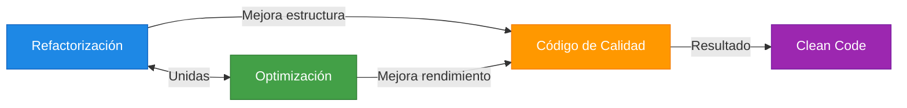
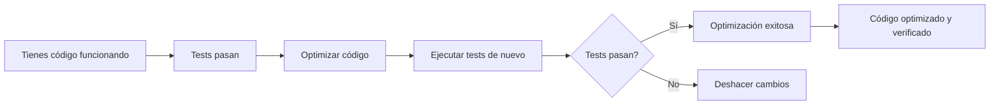

# 4. Optimización de Código

- [4. Optimización de Código](#4-optimización-de-código)
  - [4.1. ¿Qué es la Optimización?](#41-qué-es-la-optimización)
    - [Diferencia con Refactorización](#diferencia-con-refactorización)
  - [4.2. La Relación Entre Refactorización y Optimización](#42-la-relación-entre-refactorización-y-optimización)
    - [Ejemplo Práctico](#ejemplo-práctico)
  - [4.3. ¿Por Qué Optimizar?](#43-por-qué-optimizar)
    - [Beneficios de un Código Optimizado](#beneficios-de-un-código-optimizado)
    - [Cuando Optimizar](#cuando-optimizar)
  - [4.4. La Regla de Oro: Tests Primero](#44-la-regla-de-oro-tests-primero)
  - [4.5. Optimizaciones con Ejemplos](#45-optimizaciones-con-ejemplos)
    - [4.4.1. Switch vs Pattern Matching](#441-switch-vs-pattern-matching)
    - [4.4.2. Diccionarios en vez de Switch](#442-diccionarios-en-vez-de-switch)
    - [4.4.3. No usar for/if, usar LINQ](#443-no-usar-forif-usar-linq)
    - [4.4.4. Usar LINQ para transformaciones](#444-usar-linq-para-transformaciones)
    - [4.4.5. Usar Any() en vez de Count() \> 0](#445-usar-any-en-vez-de-count--0)
    - [4.4.6. Usar Enums con Funcionalidad](#446-usar-enums-con-funcionalidad)
    - [4.4.7. Clases Estáticas para Utilidades](#447-clases-estáticas-para-utilidades)
    - [4.4.8. Pattern Matching Avanzado](#448-pattern-matching-avanzado)
    - [4.4.9. Algoritmos de Ordenación](#449-algoritmos-de-ordenación)
    - [4.4.10. Usar StringBuilder para concatenaciones](#4410-usar-stringbuilder-para-concatenaciones)
    - [4.4.11. Null Coalescing Operator](#4411-null-coalescing-operator)
    - [4.4.12. Interpolación de Strings](#4412-interpolación-de-strings)
  - [4.6. Convenciones de Nombres en C#](#46-convenciones-de-nombres-en-c)
    - [Nombres de Identificadores](#nombres-de-identificadores)
    - [Reglas de Oro](#reglas-de-oro)
  - [4.7. Magic Numbers (Números Mágicos)](#47-magic-numbers-números-mágicos)
  - [4.8. Estructuras y Clean Code](#48-estructuras-y-clean-code)
    - [Estructura de una Clase](#estructura-de-una-clase)
    - [Estructura de Control](#estructura-de-control)
    - [Espacios en Blanco](#espacios-en-blanco)
  - [4.9. Code Smells (Malos Olores)](#49-code-smells-malos-olores)
    - [Code Smells Principales](#code-smells-principales)
    - [Ejemplos de Code Smells](#ejemplos-de-code-smells)
  - [4.10. Patrones de Refactorización](#410-patrones-de-refactorización)
    - [Patrones Más Usuales](#patrones-más-usuales)
    - [Ejemplo: Replace Conditional with Polymorphism](#ejemplo-replace-conditional-with-polymorphism)
  - [4.11. Buenas Prácticas de Clean Code](#411-buenas-prácticas-de-clean-code)
    - [Principios Fundamentales](#principios-fundamentales)
    - [Consejos Prácticos](#consejos-prácticos)
    - [Comparación de Objetos](#comparación-de-objetos)
  - [4.12. Optimización y Clean Code](#412-optimización-y-clean-code)
    - [Relación entre Calidad y Optimización](#relación-entre-calidad-y-optimización)
  - [4.13. Cuándo NO Optimizar](#413-cuándo-no-optimizar)
  - [4.14. Resumen](#414-resumen)


---

## 4.1. ¿Qué es la Optimización?

La optimización de código es el proceso de mejorar el rendimiento y la eficiencia del código sin cambiar su comportamiento. Un código optimizado es más rápido, consume menos recursos y es más mantenible.

> **📝 Nota del Profesor:** Optimizar NO significa hacer código críptico o difíciles de leer. Significa escribir código elegante que sea eficiente. Un código bien optimizado también suele ser más limpio y legible.


La optimización es el proceso de modificar el código para que sea:
- **Más rápido** en ejecución
- **Más eficiente** en uso de memoria
- **Más limpio** y legible
- **Más mantenible** a largo plazo

### Diferencia con Refactorización

| Aspecto                | Refactorización             | Optimización           |
| ---------------------- | --------------------------- | ---------------------- |
| **Objetivo principal** | Mejorar estructura          | Mejorar rendimiento    |
| **Enfoque**            | Legibilidad y mantenimiento | Velocidad y eficiencia |
| **Resultado**          | Código más limpio           | Código más rápido      |
| **Relación**           | Frecuentemente optimización | Frecuentemente refactorización |

> **⚠️ Importante:** En la práctica, refactorización y optimización van de la mano. Cuando optimizas código, frecuentemente lo refactorizas. Y cuando refactorizas para mejorar la estructura, a menudo también mejoras el rendimiento.

---

## 4.2. La Relación Entre Refactorización y Optimización

> **📝 Nota del Profesor:** Son dos caras de la misma moneda. No puedes tener código bien optimizado que sea difícil de mantener, ni código muy limpio que sea innecesariamente lento.



### Ejemplo Práctico

| Código Original       | Refactorizado y Optimizado | Beneficios                      |
| --------------------- | -------------------------- | ------------------------------- |
| Switch de 20 casos    | Dictionary                 | Estructura mejor + O(1) vs O(n) |
| for con if anidados   | LINQ                       | Más legible + Más conciso       |
| Magic numbers         | Constantes                 | Mantenible + Explícito          |
| Métodos de 100 líneas | Métodos de 10 líneas       | Testeable + Reutilizable        |

> **💡 Tip del Examinador:** Cuando te pregunten en un examen sobre la diferencia entre refactorización y optimización, explica que están muy relacionadas. La optimización ES una forma de refactorización cuando no cambia el comportamiento externo.

---

> **💡 Analogía:** La refactorización es como organizar tu habitación (todo en su lugar). La optimización es como comprar muebles más eficientes que ocupan menos espacio y funcionan mejor.

---

## 4.3. ¿Por Qué Optimizar?

### Beneficios de un Código Optimizado

1. **Rendimiento:** Menor tiempo de ejecución
2. **Recursos:** Menor consumo de memoria y CPU
3. **UX:** Aplicaciones más responsivas
4. **Escalabilidad:** Soporta más usuarios/datos
5. **Calidad:** Código más profesional

### Cuando Optimizar

> **⚠️ Error Común:** "Premature optimization is the root of all evil" (Donald Knuth)

**Debes optimizar cuando:**
- ✅ Ya tienes código que funciona
- ✅ Has identificado cuellos de botella con profiling
- ✅ Los tests pasan
- ✅ El código es parte crítica del sistema

**No optimices cuando:**
- ❌ Es código que casi no se ejecuta
- ❌ No tienes tests que verifiquen comportamiento
- ❌ Antes de medir con profiling

---

## 4.4. La Regla de Oro: Tests Primero

> **📝 Nota del Profesor:** Antes de optimizar, SIEMPRE debes tener tests. Si optimizas sin tests, puedes introducir bugs sin darte cuenta.



---

## 4.5. Optimizaciones con Ejemplos

### 4.4.1. Switch vs Pattern Matching

** ANTES (Switch tradicional):**
```csharp
public string GetTipoProducto(Producto producto)
{
    switch (producto.Tipo)
    {
        case 1:
            return "Electrónica";
        case 2:
            return "Ropa";
        case 3:
            return "Alimentos";
        case 4:
            return "Libros";
        default:
            return "Desconocido";
    }
}
```

**DESPUÉS (Pattern Matching):**
```csharp
public string GetTipoProducto(Producto producto)
{
    return producto.Tipo switch
    {
        TipoProducto.Electronica => "Electrónica",
        TipoProducto.Ropa => "Ropa",
        TipoProducto.Alimentos => "Alimentos",
        TipoProducto.Libros => "Libros",
        _ => "Desconocido"
    };
}
```

**Mejora:**
- ✅ Código más conciso
- ✅ Tipo seguro (enum en lugar de int)
- ✅ Más legible
- ✅ Menos propenso a errores

---

### 4.4.2. Diccionarios en vez de Switch

** ANTES (Switch para buscar valor):**
```csharp
public int GetPrecioEnvio(string pais)
{
    switch (pais.ToLower())
    {
        case "españa":
            return 5;
        case "francia":
            return 8;
        case "alemania":
            return 10;
        case "italia":
            return 7;
        case "portugal":
            return 4;
        default:
            return 15;
    }
}
```

**DESPUÉS (Dictionary para búsqueda O(1)):**
```csharp
private readonly Dictionary<string, int> _preciosEnvio = new()
{
    ["españa"] = 5,
    ["francia"] = 8,
    ["alemania"] = 10,
    ["italia"] = 7,
    ["portugal"] = 4
};

private const int PrecioDefault = 15;

public int GetPrecioEnvio(string pais)
{
    return _preciosEnvio.TryGetValue(pais.ToLower(), out var precio)
        ? precio
        : PrecioDefault;
}
```

**Mejora:**
- ✅ Búsqueda O(1) vs O(n) del switch
- ✅ Más rápido para muchos casos
- ✅ Fácil de mantener (solo añadir al diccionario)
- ✅ También funciona para valores complejos

---

### 4.4.3. No usar for/if, usar LINQ

** ANTES (Bucles con condiciones):**
```csharp
public List<Estudiante> ObtenerAprobados(List<Estudiante> estudiantes)
{
    var aprobados = new List<Estudiante>();
    
    for (int i = 0; i < estudiantes.Count; i++)
    {
        if (estudiantes[i].Nota >= 5)
        {
            aprobados.Add(estudiantes[i]);
        }
    }
    
    return aprobados;
}
```

**DESPUÉS (LINQ):**
```csharp
public List<Estudiante> ObtenerAprobados(List<Estudiante> estudiantes)
{
    return estudiantes
        .Where(e => e.Nota >= 5)
        .ToList();
}
```

**Mejora:**
- ✅ Código declarativo (qué quieres vs cómo lo haces)
- ✅ Más legible
- ✅ Menos líneas de código
- ✅ Inmutable (no modifica la lista original)

---

### 4.4.4. Usar LINQ para transformaciones

** ANTES (Bucle para transformar):**
```csharp
public List<string> ObtenerNombresMayusculas(List<Estudiante> estudiantes)
{
    var nombres = new List<string>();
    
    foreach (var estudiante in estudiantes)
    {
        nombres.Add(estudiante.Nombre.ToUpper());
    }
    
    return nombres;
}
```

**DESPUÉS (Select):**
```csharp
public List<string> ObtenerNombresMayusculas(List<Estudiante> estudiantes)
{
    return estudiantes
        .Select(e => e.Nombre.ToUpper())
        .ToList();
}
```

---

### 4.4.5. Usar Any() en vez de Count() > 0

** ANTES:**
```csharp
if (lista.Count > 0)
{
    // Hacer algo
}
```

**DESPUÉS:**
```csharp
if (lista.Any())
{
    // Hacer algo
}
```

**Mejora:**
- ✅ Any() es O(1) para ICollection
- ✅ Count() puede ser O(n) para IEnumerable
- ✅ Any() se detiene en el primer elemento encontrado

---

### 4.4.6. Usar Enums con Funcionalidad

** ANTES (Enum simple + switch):**
```csharp
public enum DiaSemana { Lunes, Martes, Miercoles, Jueves, Viernes, Sabado, Domingo }

public bool EsLaborable(int dia)
{
    return dia switch
    {
        0 => true,  // Lunes
        1 => true,  // Martes
        2 => true,  // Miércoles
        3 => true,  // Jueves
        4 => true,  // Viernes
        _ => false  // Sábado, Domingo
    };
}
```

**DESPUÉS (Enum con métodos de extensión):**
```csharp
public enum DiaSemana 
{ 
    Lunes = 1, 
    Martes = 2, 
    Miercoles = 3, 
    Jueves = 4, 
    Viernes = 5, 
    Sabado = 6, 
    Domingo = 7 
}

public static class DiaSemanaExtensions
{
    public static bool EsLaborable(this DiaSemana dia)
    {
        return dia != DiaSemana.Sabado && dia != DiaSemana.Domingo;
    }
    
    public static bool EsFinDeSemana(this DiaSemana dia)
    {
        return dia == DiaSemana.Sabado || dia == DiaSemana.Domingo;
    }
}

// Uso
var esLaborable = DiaSemana.Lunes.EsLaborable();
```

**Mejora:**
- ✅ Código más legible
- ✅ autocomplete del IDE
- ✅ Métodos juntos con el tipo
- ✅ Sin switch

---

### 4.4.7. Clases Estáticas para Utilidades

** ANTES (Clase con métodos de instancia):**
```csharp
public class Calculadora
{
    public int Sumar(int a, int b) => a + b;
    public int Restar(int a, int b) => a - b;
    public int Multiplicar(int a, int b) => a * b;
}

// Uso
var calc = new Calculadora();
var resultado = calc.Sumar(5, 3);
```

**DESPUÉS (Clase estática):**
```csharp
public static class Calculadora
{
    public static int Sumar(int a, int b) => a + b;
    public static int Restar(int a, int b) => a - b;
    public static int Multiplicar(int a, int b) => a * b;
}

// Uso
var resultado = Calculadora.Sumar(5, 3);
```

**Mejora:**
- ✅ No necesita instanciar
- ✅ Sin estado (stateless)
- ✅ Más claro que es una utilidad
- ✅ Mejor rendimiento (sin creación de objetos)

---

### 4.4.8. Pattern Matching Avanzado

** ANTES (If anidados):**
```csharp
public string Describir(object obj)
{
    if (obj is Estudiante e)
    {
        return $"Estudiante: {e.Nombre}";
    }
    else if (obj is Docente d)
    {
        return $"Docente: {d.Nombre} - {d.Departamento}";
    }
    else if (obj is Persona p)
    {
        return $"Persona: {p.Nombre}";
    }
    else if (obj is string s)
    {
        return $"Texto de longitud {s.Length}";
    }
    else if (obj is null)
    {
        return "Es null";
    }
    else
    {
        return $"Objeto tipo: {obj.GetType().Name}";
    }
}
```

**DESPUÉS (Pattern Matching completo):**
```csharp
public string Describir(object obj)
{
    return obj switch
    {
        Estudiante e => $"Estudiante: {e.Nombre}",
        Docente d => $"Docente: {d.Nombre} - {d.Departamento}",
        Persona p => $"Persona: {p.Nombre}",
        string s => $"Texto de longitud {s.Length}",
        null => "Es null",
        _ => $"Objeto tipo: {obj.GetType().Name}"
    };
}
```

---

### 4.4.9. Algoritmos de Ordenación

> **📝 Nota del Profesor:** Este es un ejemplo clásico de optimización. No todos los algoritmos son iguales.

** ANTES (Ordenación Burbuja - O(n²)):**
```csharp
public void OrdenarBurbuja(int[] array)
{
    int n = array.Length;
    for (int i = 0; i < n - 1; i++)
    {
        for (int j = 0; j < n - i - 1; j++)
        {
            if (array[j] > array[j + 1])
            {
                (array[j], array[j + 1]) = (array[j + 1], array[j]);
            }
        }
    }
}
```

**DESPUÉS (OrderBy de LINQ - O(n log n)):**
```csharp
public int[] Ordenar(int[] array)
{
    return array.OrderBy(x => x).ToArray();
}

// O para tipos comparables
public List<int> Ordenar(List<int> lista)
{
    return lista.OrderBy(x => x).ToList();
}
```

**Comparación:**

| Algoritmo    | Complejidad | Para 10.000 elementos             |
| ------------ | ----------- | --------------------------------- |
| Burbuja      | O(n²)       | ~100.000.000 operaciones          |
| QuickSort    | O(n log n)  | ~130.000 operaciones              |
| LINQ OrderBy | O(n log n)  | ~130.000 operaciones (optimizado) |

> **💡 Tip:** Siempre usa los métodos built-in de .NET. Están altamente optimizados y probados.

---

### 4.4.10. Usar StringBuilder para concatenaciones

** ANTES (Concatenación con +):**
```csharp
public string GenerarHtml(List<string> elementos)
{
    string html = "<ul>";
    
    foreach (var elemento in elementos)
    {
        html += "<li>" + elemento + "</li>";
    }
    
    html += "</ul>";
    return html;
}
```

**DESPUÉS (StringBuilder):**
```csharp
public string GenerarHtml(List<string> elementos)
{
    var sb = new StringBuilder();
    sb.Append("<ul>");
    
    foreach (var elemento in elementos)
    {
        sb.Append("<li>");
        sb.Append(elemento);
        sb.Append("</li>");
    }
    
    sb.Append("</ul>");
    return sb.ToString();
}
```

**Mejora:**
- ✅ StringBuilder evita crear nuevos strings en cada +
- ✅ Especialmente importante en bucles
- ✅ Mucho más eficiente para muchas concatenaciones

---

### 4.4.11. Null Coalescing Operator

** ANTES:**
```csharp
public string GetNombre(Usuario usuario)
{
    if (usuario == null)
    {
        return "Anónimo";
    }
    
    if (usuario.Nombre == null)
    {
        return "Sin nombre";
    }
    
    return usuario.Nombre;
}
```

**DESPUÉS:**
```csharp
public string GetNombre(Usuario usuario)
{
    return usuario?.Nombre ?? "Anónimo" ?? "Sin nombre";
}
```

**Mejura:**
- ✅ Código más conciso
- ✅ Más legible
- ✅ Evalúa de izquierda a derecha

---

### 4.4.12. Interpolación de Strings

** ANTES (Concatenación):**
```csharp
var mensaje = "El usuario " + usuario.Nombre + " tiene " + usuario.Edad + " años.";
var sql = "SELECT * FROM usuarios WHERE id = " + id + " AND activo = " + activo;
```

**DESPUÉS (Interpolación):**
```csharp
var mensaje = $"El usuario {usuario.Nombre} tiene {usuario.Edad} años.";
var sql = $"SELECT * FROM usuarios WHERE id = {id} AND activo = {activo}";
```

> **⚠️ Aviso:** Para SQL usa ALWAYS parámetros, no interpolación (SQL Injection).

---

## 4.6. Convenciones de Nombres en C#

Las convenciones de código exist because la mayoría del coste del código de un programa se usa en su mantenimiento. Mejoran la lectura del código permitiendo entender código nuevo mucho más rápido.

> **📝 Nota del Profesor:** En C#, siguiendo las convenciones de Microsoft y Clean Code, debemos ser coherentes con los nombres.

### Nombres de Identificadores

| Tipo                  | Convención               | Ejemplo                                 |
| --------------------- | ------------------------ | --------------------------------------- |
| **Clases/Interfaces** | PascalCase               | `Usuario`, `IUsuarioRepository`         |
| **Métodos**           | PascalCase               | `ObtenerUsuario()`, `CalcularTotal()`   |
| **Propiedades**       | PascalCase               | `NombreCompleto`, `FechaAlta`           |
| **Campos privados**   | _camelCase o camelCase   | `_nombre`, `_contador`                  |
| **Variables locales** | camelCase                | `var estudiantes`, `var precioFinal`    |
| **Parámetros**        | camelCase                | `(string nombre, int edad)`             |
| **Constantes**        | PascalCase o UPPER_SNAKE | `MaximoIntentos`, `TAMANIO_PAGINA`      |
| **Enums**             | PascalCase (valores)     | `TipoUsuario.Admin`, `Estado.Pendiente` |
| **Namespaces**        | PascalCase               | `GestionAcademica.Services`             |
| **Ficheros**          | Igual que la clase       | `Usuario.cs`, `IUsuarioRepository.cs`   |

### Reglas de Oro

```csharp
// ✅ BIEN - Nombres descriptivos
public class GestorDeUsuarios
{
    public List<Estudiante> ObtenerEstudiantesActivos() { ... }
}

// ❌ MAL - Nombres crípticos
public class cls
{
    public List<est> GetEst() { ... }
}
```

> **💡 Tip:** Usa nombres que expliquen qué hace el elemento, no cómo lo hace.

---

## 4.7. Magic Numbers (Números Mágicos)

Se conoce como **Magic Number** a cualquier valor literal (texto o numérico) empleado en el código sin ninguna explicación.

**❌ ANTES (Magic Numbers):**
```csharp
public decimal CalcularPrecio(decimal precioBase)
{
    return precioBase + (precioBase * 0.21m); // ¿Qué es 0.21?
}

public bool EsMayorDeEdad(int edad)
{
    return edad >= 18; // ¿Por qué 18?
}

if (usuario.Tipo == 1) // ¿Qué significa 1?
{
    // ...
}
```

**✅ DESPUÉS (Constantes con nombre):**
```csharp
public class Constantes
{
    public const decimal IVA = 0.21m;
    public const int EdadMayor = 18;
    
    public enum TipoUsuario
    {
        Admin = 1,
        Gestor = 2,
        Usuario = 3
    CalcularPrecio( }
}

public decimaldecimal precioBase)
{
    return precioBase + (precioBase * Constantes.IVA);
}

public bool EsMayorDeEdad(int edad)
{
    return edad >= Constantes.EdadMayor;
}

if (usuario.Tipo == Constantes.TipoUsuario.Admin)
{
    // ...
}
```

**Mejoras:**
- ✅ El código se explica solo
- ✅ Fácil de mantener (un solo lugar para cambiar)
- ✅ Evita errores al cambiar valores

---

## 4.8. Estructuras y Clean Code

### Estructura de una Clase

```csharp
// 1. Using statements (orden específico)
using System;
using System.Collections.Generic;
using GestionAcademica.Models;

// 2. Namespace
namespace GestionAcademica.Services
{
    // 3. Clase con documentación XMLDoc
    /// <summary>
    /// Servicio para gestionar usuarios del sistema.
    /// </summary>
    public class UsuarioService
    {
        // 4. Campos privados (constantes primero)
        private readonly ILogger _logger;
        
        // 5. Constructores
        public UsuarioService(ILogger logger)
        {
            _logger = logger;
        }
        
        // 6. Propiedades públicas
        public int TotalUsuarios { get; private set; }
        
        // 7. Métodos públicos
        public Usuario ObtenerPorId(int id) { ... }
        
        // 8. Métodos privados
        private bool ValidarUsuario(Usuario usuario) { ... }
    }
}
```

### Estructura de Control

```csharp
// ✅ BIEN - Llaves siempre, aunque sea una línea
if (esValido)
{
    Procesar();
}

// ✅ BIEN - Una instrucción por línea
var nombre = usuario.Nombre;
var edad = usuario.Edad;

// ❌ MAL - Sin llaves (peligroso)
if (esValido)
    Procesar();

// ❌ MAL - Líneas muy largas
var resultado = usuario.Nombre + " " + usuario.Apellidos + " tiene " + usuario.Edad + " años y vive en " + usuario.Direccion + ", " + usuario.Ciudad;
```

### Espacios en Blanco

```csharp
// ✅ BIEN - Espacios para legibilidad
for (int i = 0; i < cantidad; i++)
{
    suma += valores[i];
}

// ✅ BIEN - Operadores con espacios
var resultado = (a + b) * c;
var nombreCompleto = $"{nombre} {apellidos}";

// ❌ MAL - Todo pegado
for(int i=0;i<cantidad;i++){suma+=valores[i];}
```

---

## 4.9. Code Smells (Malos Olores)

Los **Code Smells** o "malos olores" son indicadores de problemas en el código que posiblemente ocultan problemas más profundos. No son errores (el código funciona), pero dificultan el mantenimiento.

### Code Smells Principales

| Code Smell                    | Descripción                                       | Solución                     |
| ----------------------------- | ------------------------------------------------- | ---------------------------- |
| **Código Duplicado**          | Mismo código en varios lugares                    | Extraer método               |
| **Método Largo**              | Métodos de muchas líneas                          | Extraer métodos más pequeños |
| **Clase Grande**              | Demasiadas responsabilidades                      | Dividir en clases            |
| **Lista de Parámetros Larga** | Muchos parámetros en un método                    | Crear objeto parámetro       |
| **Cambio Divergente**         | Clase modificada por muchas razones               | Separar responsabilidades    |
| **Cirugía a Tiros**           | Cambios en una clase requieren cambios en otras   | Acoplar correctamente        |
| **Envidia de Funcionalidad**  | Clase que usa más métodos de otra que de sí misma | Mover método                 |
| **Legado Rechazado**          | Subclase que no usa casi nada de la padre         | Rethink herencia             |
| **Clase Perezosa**            | Clase que hace muy poco                           | Eliminar o combinar          |
| **Comentarios Excesivos**     | Comentarios que explican código confuso           | Refactorizar código          |

### Ejemplos de Code Smells

**Código Duplicado:**
```csharp
// ❌ MAL - Código duplicado
public void GuardarEstudiante(Estudiante e)
{
    ValidarEstudiante(e);
    _context.Estudiantes.Add(e);
    _context.SaveChanges();
    Log("Estudiante guardado");
}

public void GuardarProfesor(Profesor p)
{
    ValidarProfesor(p);  // Similar
    _context.Profesores.Add(p);  // Similar
    _context.SaveChanges();  // Duplicado
    Log("Profesor guardado");  // Duplicado
}

// ✅ BIEN - Extraer método común
public void Guardar<T>(T entidad) where T : class
{
    _context.Set<T>().Add(entidad);
    _context.SaveChanges();
    Log($"{typeof(T).Name} guardado");
}
```

**Método Largo:**
```csharp
// ❌ MAL - Método de 50 líneas
public void ProcesarPedidoCompleto(Pedido pedido)
{
    // 20 líneas de validación
    // 10 líneas de cálculo de precio
    // 10 líneas de inventario
    // 5 líneas de pago
    // 5 líneas de notificación
}

// ✅ BIEN - Métodos pequeños
public void ProcesarPedidoCompleto(Pedido pedido)
{
    ValidarPedido(pedido);
    var precio = CalcularPrecio(pedido);
    ActualizarInventario(pedido);
    ProcesarPago(pedido, precio);
    NotificarCliente(pedido);
}
```

---

## 4.10. Patrones de Refactorización

Los patrones de refactorización son soluciones probadas a problemas comunes:

### Patrones Más Usuales

| Patrón                         | Descripción                        | Cuándo Usar                            |
| ------------------------------ | ---------------------------------- | -------------------------------------- |
| **Rename**                     | Cambiar nombre                     | Nombre no descriptivo                  |
| **Extract Method**             | Extraer método                     | Código repetido o largo                |
| **Inline**                     | Inline método                      | Método trivial de una línea            |
| **Move**                       | Mover a otra clase                 | Responsabilidad incorrecta             |
| **Extract Class**              | Extraer clase                      | Clase con demasiadas responsabilidades |
| **Extract Interface**          | Extraer interfaz                   | Necesitas abstracción                  |
| **Introduce Parameter Object** | Crear objeto parámetro             | Demasiados parámetros                  |
| **Replace Conditional**        | Cambiar if/switch por polimorfismo | Lógica de negocio compleja             |
| **Replace Magic Number**       | Usar constante                     | Números sin explicación                |
| **Encapsulate Field**          | Crear propiedad                    | Campo público                          |

### Ejemplo: Replace Conditional with Polymorphism

**❌ ANTES (Switch):**
```csharp
public decimal CalcularDescuento(Producto producto)
{
    switch (producto.Tipo)
    {
        case "Electronica": return producto.Precio * 0.20m;
        case "Ropa": return producto.Precio * 0.30m;
        case "Alimentos": return producto.Precio * 0.10m;
        default: return 0;
    }
}
```

**✅ DESPUÉS (Polimorfismo):**
```csharp
public interface ICalculadorDescuento
{
    decimal Calcular(Producto producto);
}

public class DescuentoElectronica : ICalculadorDescuento
{
    public decimal Calcular(Producto p) => p.Precio * 0.20m;
}

public class DescuentoRopa : ICalculadorDescuento
{
    public decimal Calcular(Producto p) => p.Precio * 0.30m;
}
```

---

## 4.11. Buenas Prácticas de Clean Code

### Principios Fundamentales

1. **DRY (Don't Repeat Yourself):** No repetir código
2. **KISS (Keep It Simple, Stupid):** Simplicidad
3. **YAGNI (You Aren't Gonna Need It):** No agregar funcionalidad "por si acaso"
4. **SOLID:**
   - **S**ingle Responsibility: Una responsabilidad
   - **O**pen/Closed: Abierto para extensión, cerrado para modificación
   - **L**iskov Substitution: Sustitución de tipos
   - **I**nterface Segregation: Interfaces pequeñas
   - **D**ependency Inversion: Depender de abstracciones

### Consejos Prácticos

```csharp
// ✅ Métodos pequeños y con una responsabilidad
public bool ValidarUsuario(Usuario usuario)
{
    return !string.IsNullOrWhiteSpace(usuario.Nombre)
        && usuario.Edad > 0
        && !string.IsNullOrWhiteSpace(usuario.Email);
}

// ✅ Returns tempranos
publicUsuario? ObtenerPorId(int id)
{
    if (id <= 0)
        return null;
        
    return _repository.GetById(id);
}

// ✅ Nombres que revelan intención
var diasDesdeUltimoLogin = (DateTime.Now - usuario.UltimoLogin).Days;

// ❌ Nombres confusos
var d = (DateTime.Now - u.l).Days;
```

### Comparación de Objetos

> **⚠️ Importante:** Los objetos se comparan por referencia, no por valor.

```csharp
string a = "hola";
string b = "hola";

// ❌ MAL - Compara referencias
if (a == b) // Funciona por luck con strings

// ✅ BIEN - Equals para objetos
if (a.Equals(b))

// ✅ BIEN - Para objetos complejos
if (usuario1.Id == usuario2.Id)
```

---

## 4.12. Optimización y Clean Code

> **📝 Nota del Profesor:** Un código bien optimizado ES un código limpio. Las optimizaciones que hemos visto hacen el código más legible, no más críptico.

### Relación entre Calidad y Optimización

| Principio Clean Code        | Optimización Aplicable                       |
| --------------------------- | -------------------------------------------- |
| Nombres claros              | Uso de diccionarios con nombres descriptivos |
| Métodos pequeños            | Extraer métodos, LINQ                        |
| Una responsabilidad         | Enums con métodos de extensión               |
| DRY (Don't Repeat Yourself) | Evitar switch duplicados                     |
| Código expresivo            | Pattern Matching, Null Coalescing            |

---

## 4.13. Cuándo NO Optimizar

1. **Sin profiling:** No optimices sin medir primero
2. **Código no crítico:** No gastes esfuerzo en código que casi no se ejecuta
3. **Sin tests:** Puede introducir bugs
4. **Legibilidad vs velocidad:** A veces el código más legible es preferible

> **💡 Tip del Examinador:** El mejor código es el que otros pueden entender y mantener. Optimiza solo cuando sea necesario y siempre manteniendo la legibilidad.

---

## 4.14. Resumen

La optimización de código busca:

1. **Rendimiento** - Código más rápido
2. **Eficiencia** - Menor uso de recursos
3. **Limpieza** - Código más legible

**Técnicas vistas:**
- ✅ Pattern Matching vs Switch
- ✅ Diccionarios para búsquedas rápidas
- ✅ LINQ para operaciones declarativas
- ✅ Enums con métodos de extensión
- ✅ Clases estáticas para utilidades
- ✅ Algoritmos eficientes (OrderBy vs Burbuja)
- ✅ StringBuilder para concatenaciones
- ✅ Null Coalescing Operator
- ✅ Interpolación de strings

> **📝 Nota del Profesor:** Remember: "First make it work, then make it fast" ( primero haz que funcione, luego hazlo rápido). No optimices hasta que tengas código que funcione y tests que lo verifiquen.

> **💡 Tip del Examinador:** En un examen, justifica cada optimización. No es solo "usar LINQ", es explicar POR QUÉ es mejor (más legible, más eficiente, etc.).
