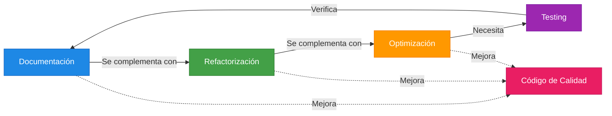
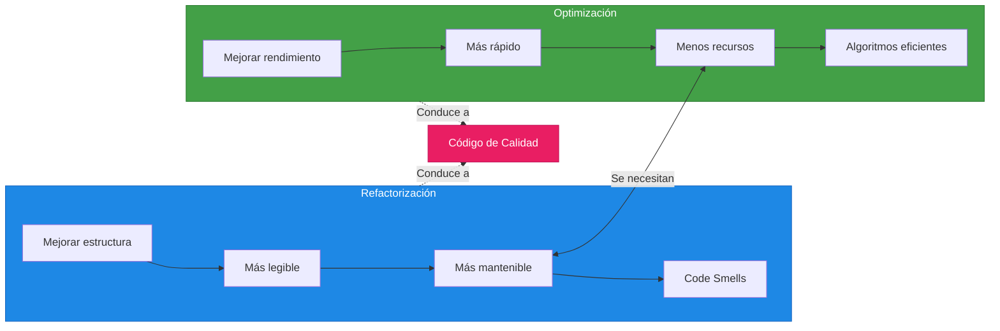

# 5. Resumen y Checklist de Evaluación

---

## 5.1. Resumen Ejecutivo

La **Unidad 06: Clean Code - Documentación, Refactorización y Optimización** forma parte del módulo de Entornos de Desarrollo y enseña las prácticas fundamentales para escribir código de calidad profesional. Esta unidad complementa los conocimientos de diseño UML adquiridos en unidades anteriores, añadiendo la dimensión de la calidad del código en sí mismo.

### Conceptos Clave Aprendidos

| Tema                  | Propósito                              | Pregunta que Responde          |
| -------------------- | -------------------------------------- | ------------------------------ |
| **Documentación**    | Explicar el código para otros         | ¿Cómo uso este código?        |
| **Markdown**        | Formato estándar para documentación   | ¿Cómo documento cleanly?       |
| **Refactorización** | Mejorar estructura sin cambiar comportamiento | ¿Cómo hago el código más legible? |
| **Optimización**    | Mejorar rendimiento y eficiencia      | ¿Cómo hago el código más rápido? |

### La Relación Entre Todo

> **📝 Nota del Profesor:** La documentación, refactorización y optimización van de la mano. Un código bien documentado es más fácil de refactorizar. Un código bien refactorizado es más fácil de optimizar. Y todo necesita tests para verificar que no rompemos funcionalidad.

---

## 5.2. Mapa Mental de la Unidad

```mermaid
graph TD
    A["📚 UD06<br/>Clean Code"] --> B["📖 1. Documentación"]
    A --> C["📖 2. Markdown"]
    A --> D["📖 3. Refactorización"]
    A --> E["📖 4. Optimización"]
    
    B --> B1["XMLDoc en C#"]
    B --> B2["Tags principales"]
    B --> B3["Interfaces y Clases"]
    B --> B4["Excepciones"]
    
    C --> C1["Sintaxis básica"]
    C --> C2["Sintaxis extendida"]
    C --> C3["Renderizado HTML/PDF"]
    C --> C4["Tips y Hacks"]
    
    D --> D1["Qué es refactorizar"]
    D --> D2["Cuándo refactorizar"]
    D --> D3["Rider refactorings"]
    D --> D4["Code Smells"]
    
    E --> E1["Qué es optimizar"]
    E --> E2["Cuándo optimizar"]
    E --> E3["Patrones de diseño"]
    E --> E4["Convenciones nombres"]
    E --> E5["Magic Numbers"]
    E --> E6["Clean Code"]
    
    D2 --> D2a["Tests primero"]
    D2 --> D2b["Código duplicado"]
    D2 --> D2c["Métodos largos"]
    
    E3 --> E3a["Pattern Matching"]
    E3 --> E3b["LINQ vs for"]
    E3 --> E3c["Diccionarios"]
    E3 --> E3d["Enums con métodos"]
    
    style A fill:#1e88e5,stroke:#1565c0,color:#fff
    style B fill:#43a047,stroke:#2e7d32,color:#fff
    style C fill:#43a047,stroke:#2e7d32,color:#fff
    style D fill:#ff9800,stroke:#f57c00,color:#fff
    style E fill:#9c27b0,stroke:#7b1fa2,color:#fff
```

---

## 5.3. La Relación Entre Refactorización y Optimización

### Tabla Comparativa

| Aspecto           | Refactorización          | Optimización              |
| ----------------- | ---------------------- | ------------------------ |
| **Objetivo**      | Mejorar estructura     | Mejorar rendimiento      |
| **Cambia comportamiento** | No             | No (si está bien hecho) |
| **Resultado**     | Código más limpio      | Código más rápido        |
| **Relación**      | Frecuentemente optimización | Frecuentemente refactorización |
| **Herramientas**  | IDE (Rider, VS)       | IDE + Profiling          |
| **Verificación**  | Tests unitarios        | Tests + Benchmarks       |

---

## 5.4. Recursos Adicionales

### 📖 Documentación Oficial
- [XMLDoc en C#](https://learn.microsoft.com/es-es/dotnet/csharp/language-reference/xmldoc/)
- [Guía de Estilo C#](https://learn.microsoft.com/es-es/dotnet/csharp/fundamentals/coding-style/coding-conventions)
- [Refactorizaciones en Rider](https://www.jetbrains.com/help/rider/Refactorings__Index.html)
- [Markdown Guide](https://www.markdownguide.org/)

### 🛠 Herramientas Recomendadas
- **Rider/Visual Studio:** IDE con refactorizaciones integradas
- **Mermaid Live Editor:** https://mermaid.live/
- **Docsify/MkDocs:** Generadores de documentación desde Markdown
- **DotMemory/DotTrace:** Herramientas de profiling para .NET

### 📚 Bibliografía
- "Clean Code" - Robert C. Martin
- "Refactoring" - Martin Fowler
- "The Pragmatic Programmer" - Andrew Hunt, David Thomas

---

## 5.5. Glosario de Términos

| Término                     | Definición                                                             |
| --------------------------- | ---------------------------------------------------------------------- |
| **XMLDoc**                  | Sistema de documentación de C# con tags XML (`///`)                 |
| **Markdown**                | Lenguaje de marcado ligero para documentación                        |
| **Refactorización**         | Mejora de estructura sin cambiar comportamiento                        |
| **Optimización**            | Mejora de rendimiento sin cambiar comportamiento                        |
| **Code Smell**              | Indicador de posible problema en el código                            |
| **Magic Number**            | Valor literal sin explicación (debe ser constante)                  |
| **Clean Code**              | Código legible, mantenible y bien estructurado                         |
| **DRY**                     | Don't Repeat Yourself - No repetir código                             |
| **KISS**                    | Keep It Simple, Stupid - Simplicidad                                   |
| **Pattern Matching**        | Evaluación de patrones en C# para reemplazar switch                 |
| **LINQ**                    | Language Integrated Query - Consultas en C#                           |
| **Tests Unitarios**         | Pruebas que verifican funciones individuales                          |
| **Deuda Técnica**          | Costo futuro por decisiones de diseño mediocres                      |
| **Convention over Config**  | Convenciones en lugar de configuración                                |

---

> **💡 Consejo Final:** La práctica hace al maestro. Cada vez que escribas código, pregúntate: ¿Es legible? ¿Se mantiene fácil? ¿Está documentado? ¿Se puede optimizar? Y lo más importante: siempre, siempre, siempre tiene que pasar los tests.

> **📝 Nota del Profesor:** Remember: "First make it work, then make it clean, then make it fast" (primero haz que funcione, luego hazlo limpio, luego hazlo rápido). No optimices sin tener código que funcione y tests que lo verifiquen.
